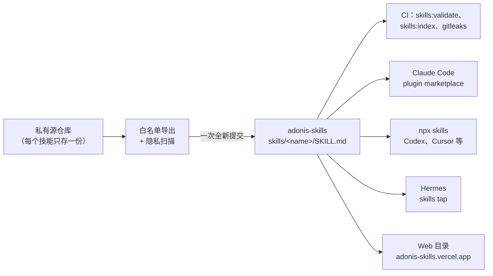

[English](./README.md) | 中文

# adonis-skills

面向 coding agent 的通用技能集：评审循环、工作流分流、MCP 配置、Git 交付和本机环境审计。可安装到 Claude Code、Codex、Cursor、Hermes，或任何读取 `SKILL.md` 的 agent。

**在线地址**：<https://adonis-skills.vercel.app/>

<picture>
  <source media="(prefers-color-scheme: dark)" srcset="./docs/assets/overview-zh-dark.svg">
  
</picture>

## 快速开始

| 宿主                                                                            | 安装方式                                                                                                |
| ------------------------------------------------------------------------------- | ------------------------------------------------------------------------------------------------------- |
| Codex、Cursor 等 agent（[`skills` CLI](https://github.com/vercel-labs/skills)） | `npx skills add adonis0123/adonis-skills --skill <name>`（加 `-g` 全局安装，`--list` 列出技能）         |
| Claude Code                                                                     | 先 `/plugin marketplace add Adonis0123/adonis-skills`，再 `/plugin install adonis-skills@adonis-skills` |
| Hermes Agent                                                                    | `hermes skills tap add adonis0123/adonis-skills`                                                        |

示例：

```bash
npx skills add adonis0123/adonis-skills --skill workflow-gate
npx skills add adonis0123/adonis-skills --skill chrome-dev-mcp -g
npx skills add adonis0123/adonis-skills --list
```

## 技能列表

| 技能                                                                            | 用途                                                                                                   |
| ------------------------------------------------------------------------------- | ------------------------------------------------------------------------------------------------------ |
| **评审与完成循环**                                                              |                                                                                                        |
| [`agentic-review-handoff`](./skills/agentic-review-handoff)                     | 核实粘贴来的评审意见；在同一会话里用 headless reviewer 跑“评审-修复-复审”循环；恢复评审会话或 packet。 |
| [`open-code-review-loop`](./skills/open-code-review-loop)                       | 有轮次上限的 open-code-review 委托循环，直到当前证据显示没有问题。                                     |
| [`review-prompt-composer`](./skills/review-prompt-composer)                     | 生成一份可直接复制的提示词，让另一个 agent 评审同一工作树的改动。                                      |
| [`architecture-hardening-loop`](./skills/architecture-hardening-loop)           | 对指定代码范围循环扫描、分诊、修复、评审、复扫，直到没有有证据的架构修复项。                           |
| [`task-completion-loop`](./skills/task-completion-loop)                         | 按工作台账、Goal、实现证明、评审和最终审计，完成一个已命名的计划或有边界的编码任务。                   |
| **工作流分流**                                                                  |                                                                                                        |
| [`workflow-gate`](./skills/workflow-gate)                                       | 路线选择有影响时，判断该走哪个工作流或技能。                                                           |
| [`goal-gate`](./skills/goal-gate)                                               | 判断任务是否需要可验证的 Goal 契约，并起草、启动或关闭它。                                             |
| **Git 交付**                                                                    |                                                                                                        |
| [`commit`](./skills/commit)                                                     | 生成 emoji Conventional Commit 信息，或创建聚焦的本地提交。                                            |
| [`commit-push`](./skills/commit-push)                                           | 提交并推送一组已检查的改动，并核实远端已收到。                                                         |
| [`branch-creator`](./skills/branch-creator)                                     | 用简洁名称安全地创建 feature 或 hotfix 分支。                                                          |
| **MCP 与工具配置**                                                              |                                                                                                        |
| [`chrome-dev-mcp`](./skills/chrome-dev-mcp)                                     | 在各 agent 宿主上配置、恢复并验证 Chrome DevTools MCP 连接。                                           |
| [`figma-mcp`](./skills/figma-mcp)                                               | 按宿主安装、认证并验证官方 Figma MCP server。                                                          |
| [`kimi-computer-use`](./skills/kimi-computer-use)                               | 安装、注册或诊断 Kimi Computer Use MCP。                                                               |
| [`ardot-mcp`](./skills/ardot-mcp)                                               | 通过 UXC 封装 Ardot MCP 并完成 OAuth 配置。                                                            |
| [`uxc-facade`](./skills/uxc-facade)                                             | 把 MCP、OpenAPI、GraphQL、gRPC 或 JSON-RPC 接口封装成稳定的 UXC CLI。                                  |
| **Web 与前端**                                                                  |                                                                                                        |
| [`web-performance-audit`](./skills/web-performance-audit)                       | 对真实 Web 应用做只读、以证据为准的运行时性能审计。                                                    |
| [`local-web-surface`](./skills/local-web-surface)                               | 在稳定的 `*.localhost` 地址上搭建常驻的 macOS 本地 Web 页面。                                          |
| [`code-inspector-init`](./skills/code-inspector-init)                           | 用 code-inspector-plugin 配置点击跳转源码。                                                            |
| [`lingui-workflow`](./skills/lingui-workflow)                                   | Lingui 日常的提取、检查、编译和 catalog 命令。                                                         |
| **仓库配置与写作**                                                              |                                                                                                        |
| [`agent-symlink-init`](./skills/agent-symlink-init)                             | 把 `.claude/skills` 链到 `.agents/skills`，把 `AGENTS.md` 链到 `CLAUDE.md`。                           |
| [`code-plugin-architecture`](./skills/code-plugin-architecture)                 | 设计或评审插件注册表和扩展点。                                                                         |
| [`decision-first-technical-writing`](./skills/decision-first-technical-writing) | 编写或评审以决策开头的技术设计文档。                                                                   |
| [`weekly-report`](./skills/weekly-report)                                       | 基于一个或多个仓库的 Git 历史生成周报。                                                                |
| **本机环境**                                                                    |                                                                                                        |
| [`dev-environment-roi-audit`](./skills/dev-environment-roi-audit)               | 用真实日志审计 MCP server、技能和指令文件，按投入产出决定保留、收窄或移除。                            |
| [`desktop-agent-activity`](./skills/desktop-agent-activity)                     | 根据进程和文件证据，判断桌面端 coding agent 是在干活、闲置还是已停。                                   |
| [`installed-app-feature-inventory`](./skills/installed-app-feature-inventory)   | 从磁盘上的安装包列出一个 macOS 应用真正具备的功能。                                                    |

## 推荐的第三方技能

这些技能由其他仓库维护，本仓库不复制它们的内容。请从各自仓库安装。

| 仓库（许可证）                                                                          | 技能                            | 用途                                            | 安装                                                                        |
| --------------------------------------------------------------------------------------- | ------------------------------- | ----------------------------------------------- | --------------------------------------------------------------------------- |
| [larksuite/cli](https://github.com/larksuite/cli)（MIT）                                | `lark-im`                       | 收发和搜索飞书消息与群聊。                      | `npx skills add larksuite/cli --skill lark-im`                              |
|                                                                                         | `lark-doc`                      | 读取、创建和编辑飞书文档。                      | `npx skills add larksuite/cli --skill lark-doc`                             |
|                                                                                         | `lark-shared`                   | 其他 `lark-*` 技能共用的认证和约定。            | `npx skills add larksuite/cli --skill lark-shared`                          |
|                                                                                         | `lark-base`                     | 操作飞书多维表格和记录。                        | `npx skills add larksuite/cli --skill lark-base`                            |
|                                                                                         | `lark-contact`                  | 按姓名、邮箱或 open_id 查人。                   | `npx skills add larksuite/cli --skill lark-contact`                         |
|                                                                                         | `lark-wiki`                     | 浏览和管理飞书知识库。                          | `npx skills add larksuite/cli --skill lark-wiki`                            |
| [mattpocock/skills](https://github.com/mattpocock/skills)（MIT）                        | `grilling`                      | 通过连续追问给方案做压力测试。                  | `npx skills add mattpocock/skills --skill grilling`                         |
|                                                                                         | `domain-modeling`               | 梳理领域术语、`CONTEXT.md` 和 ADR。             | `npx skills add mattpocock/skills --skill domain-modeling`                  |
|                                                                                         | `codebase-design`               | 设计深模块时共用的词汇。                        | `npx skills add mattpocock/skills --skill codebase-design`                  |
|                                                                                         | `improve-codebase-architecture` | 找出可以加深模块的机会并出报告。                | `npx skills add mattpocock/skills --skill improve-codebase-architecture`    |
| [obra/superpowers](https://github.com/obra/superpowers)（MIT）                          | `systematic-debugging`          | 先找根因再提修复。                              | `npx skills add obra/superpowers --skill systematic-debugging`              |
|                                                                                         | `test-driven-development`       | 功能和修复按红-绿-重构推进。                    | `npx skills add obra/superpowers --skill test-driven-development`           |
|                                                                                         | `writing-plans`                 | 把需求写成逐步实施计划。                        | `npx skills add obra/superpowers --skill writing-plans`                     |
| [MrGeDiao/shuorenhua](https://github.com/MrGeDiao/shuorenhua)（MIT）                    | `shuorenhua`                    | 审改中英文文稿，去掉 AI 腔。                    | `npx skills add MrGeDiao/shuorenhua --skill shuorenhua`                     |
| [citrolabs/ego-lite](https://github.com/citrolabs/ego-lite)（MIT）                      | `ego-browser`                   | 用已登录的浏览器完成 agent 任务和 QA。          | `npx skills add citrolabs/ego-lite --skill ego-browser`                     |
| [vercel-labs/skills](https://github.com/vercel-labs/skills)（MIT）                      | `find-skills`                   | 在开放生态里查找和安装技能。                    | `npx skills add vercel-labs/skills --skill find-skills`                     |
| [anthropics/skills](https://github.com/anthropics/skills)（Apache-2.0，按技能）         | `skill-creator`                 | 创建、测试和改进技能。                          | `npx skills add anthropics/skills --skill skill-creator`                    |
| [alibaba/open-code-review](https://github.com/alibaba/open-code-review)（Apache-2.0）   | `open-code-review-delegate`     | 由宿主 agent 执行评审，OCR 只负责选文件和规则。 | `npx skills add alibaba/open-code-review --skill open-code-review-delegate` |
| [vercel-labs/agent-browser](https://github.com/vercel-labs/agent-browser)（Apache-2.0） | `agent-browser`                 | 面向 agent 的浏览器自动化 CLI。                 | `npx skills add vercel-labs/agent-browser --skill agent-browser`            |

## 工作原理



- 部分技能（`dev-environment-roi-audit`、`desktop-agent-activity`、`installed-app-feature-inventory`）从私有源仓库导出。与本机或公司相关的细节放在 `references/local-*.md`，这些文件永不导出。
- 第三方技能只给链接，不复制进本仓库。
- 每个技能都是 `skills/<name>/` 目录，其中 `SKILL.md` frontmatter 的 `name` 与目录名一致。

## 给 AI agent

- 仓库规则、命令和技能编写约定见 [`AGENTS.md`](./AGENTS.md)。
- [`llms.txt`](./llms.txt) 是本仓库的简要地图。
- 安装单个技能：`npx skills add adonis0123/adonis-skills --skill <name>`；用 `--list` 列出全部。

## 相关项目

- [Adonis0123/hermes-kit](https://github.com/Adonis0123/hermes-kit)：Hermes 插件和 Hermes 专用技能。

## 开发本仓库

本仓库采用 `pnpm + Turborepo + Next.js 16` 的 monorepo 架构。目标：

- 让技能可通过 `npx skills add` 直接安装
- 提供展示技能元数据与安装命令的 Web 页面
- 为后续演进预留空间（新增技能、可选 npm 发布）

目录结构：

```txt
.
├── .claude-plugin/marketplace.json   # Claude Code marketplace 清单
├── apps/web/                          # Next.js 16 Web 目录站点
├── skills/<name>/SKILL.md             # 公开技能（由 Web 应用索引）
├── .agents/skills/                    # 内部工具技能（不索引）
├── scripts/
│   ├── generate-skills-index.mjs      # 技能索引生成
│   └── validate-skills.mjs            # 技能结构校验
├── turbo.json
├── pnpm-workspace.yaml
└── .github/workflows/                 # ci.yml、privacy-scan.yml
```

本地开发：

```bash
pnpm install
pnpm skills:validate
pnpm skills:index
pnpm dev
```

在浏览器打开 `http://localhost:3000`。

如果仓库 owner 发生变化：

1. 设置 `NEXT_PUBLIC_SKILLS_REPO=<new-owner>/adonis-skills`（例如写入 `.env.local`）
2. 重启 `pnpm dev`（或重新部署）使新值生效

### 命令速查（每条命令的作用）

下表解释 `package.json` 中每个 script 的用途。

| 命令                                             | 实际执行                                                                       | 含义 / 何时使用                                                                                                                                                                                                                              |
| ------------------------------------------------ | ------------------------------------------------------------------------------ | -------------------------------------------------------------------------------------------------------------------------------------------------------------------------------------------------------------------------------------------- |
| `pnpm dev`                                       | `turbo run dev --filter=@adonis-skills/web`                                    | 启动 Web 站点开发模式（仅运行 `apps/web`）。用于日常本地页面调试。                                                                                                                                                                           |
| `pnpm build`                                     | `turbo run build`                                                              | 执行 monorepo 构建任务。提交前用于确认仓库可构建。                                                                                                                                                                                           |
| `pnpm lint`                                      | `turbo run lint`                                                               | 执行代码规范检查。修改 TS/JS 后使用。                                                                                                                                                                                                        |
| `pnpm typecheck`                                 | `turbo run typecheck`                                                          | 执行 TypeScript 类型检查。修改类型或 API 后使用。                                                                                                                                                                                            |
| `pnpm skills:new`                                | `node --experimental-strip-types ./scripts/create-skill.ts`                    | 交互式创建新 skill 的推荐入口。自动执行：初始化 -> 快速校验 -> 全量校验 -> 刷新索引。                                                                                                                                                        |
| `pnpm skills:finalize -- <skill-path>`           | `node --experimental-strip-types ./scripts/finalize-skill.ts`                  | 对已创建/已复制到 `skills/*` 的 skill 执行标准收尾：`quick-validate` -> `validate` -> `index`。支持相对与绝对路径。                                                                                                                          |
| `pnpm skills:finalize:new [-- --dry-run]`        | `node --experimental-strip-types ./scripts/finalize-new-skills.ts`             | 显式准备并暂存模式：仅当 `skills/<slug>/SKILL.md` 处于新增状态（`A` 或 `??`）时识别为新 skill，逐个执行 finalize，并暂存相关文件（`skills/<slug>` 与已变更的 skills 索引）。若未发现新增 skill，只报告当前状态并退出，不创建或暂存任何文件。 |
| `pnpm skills:init <skill-name> --path skills`    | `python3 ./.agents/skills/repo-skill-creator/scripts/init_skill.py`            | 仅初始化 skill 目录与模板内容（手动模式）。当你不想走全自动流程时使用。                                                                                                                                                                      |
| `pnpm skills:quick-validate skills/<skill-name>` | `python3 ./.agents/skills/repo-skill-creator/scripts/quick_validate.py`        | 校验单个 skill（尤其是 frontmatter 合法性）。用于修改单个 skill 后的快速自检。                                                                                                                                                               |
| `pnpm skills:openai-yaml <skill-dir>`            | `python3 ./.agents/skills/repo-skill-creator/scripts/generate_openai_yaml.py`  | 为 skill 生成 `agents/openai.yaml`（OpenAI skill interface 元数据）。需要 interface 元数据时使用。                                                                                                                                           |
| `pnpm skills:validate`                           | `turbo run skills:validate --filter=@adonis-skills/web`                        | 仓库级 skills 校验。提交前/CI 前必跑。                                                                                                                                                                                                       |
| `pnpm skills:index`                              | `turbo run skills:index --filter=@adonis-skills/web`                           | 重新生成 `apps/web/src/generated/skills-index-lite.json` 与 `apps/web/src/generated/skills-detail-index.json`。新增或修改 skill 后用于刷新 Web 数据。                                                                                        |
| `pnpm skills:install:local`                      | `node --experimental-strip-types ./scripts/install-local-skills.ts`            | 将 `skills/` 安装到本地 `.agents/skills`（支持交互选择、`--all`、`--skill`）。用于本地 agent 联调。                                                                                                                                          |
| `pnpm skills:test:local`                         | `node --experimental-strip-types ./scripts/install-local-skills.ts --sync-llm` | 先本地安装，再确保 `.claude/skills` 指向 `.agents/skills`。用于同时验证本机 Claude/Codex 运行场景。                                                                                                                                          |

补充：

- 默认仓库校验（不传 skill 路径）：`skills:validate`
- 新增 skill 的常用顺序：`skills:new` -> `skills:validate` -> `skills:index`
- 手动模式常用顺序：`skills:init`（或手工复制）-> `skills:finalize -- <skill-path>`

### 新增 Skill 标准流程（SOP）

准备并暂存模式（仅当你已在 `skills/*` 下新增/复制 skill，且希望暂存这些新增文件时使用）：

```bash
pnpm skills:finalize:new
```

仅预览将执行内容（dry-run）：

```bash
pnpm skills:finalize:new -- --dry-run
```

推荐快速路径：

```bash
pnpm skills:new
```

默认会交互收集 `name`、`description`、可选资源目录，并自动执行：

1. 初始化 skill 目录（默认路径：`skills/`）
2. 单 skill 快速校验（`skills:quick-validate`）
3. 全仓库校验（`skills:validate`）
4. 更新索引（`skills:index`）

非交互创建示例：

```bash
pnpm skills:new -- --name demo-skill --description "用于演示新增 skill 流程" --resources scripts,references --non-interactive
```

手动模式（先初始化或复制，再执行收尾）：

```bash
pnpm skills:init <skill-name> --path skills --resources scripts,references
pnpm skills:finalize -- skills/<skill-name>
```

仅收尾（无需重新初始化）：

```bash
# 相对路径
pnpm skills:finalize -- skills/code-inspector-init

# 绝对路径（末尾 / 会自动处理）
pnpm skills:finalize -- "$REPO_ROOT/skills/code-inspector-init/"

# 仅预览将执行的命令，不实际执行
pnpm skills:finalize -- --dry-run skills/code-inspector-init
```

### 本地交互安装与测试

本仓库支持将 `skills/` 内的技能安装到 `.agents/skills`。`.claude/skills` 应该是指向 `.agents/skills` 的 symlink，用于本机 Claude/Codex 运行时测试。

```bash
# 默认进入交互菜单（select + checkbox）
pnpm skills:install:local

# 交互安装后，确保 .claude/skills symlink
pnpm skills:test:local
```

交互菜单流程：

1. 选择 `Install selected skills` / `Install all skills` / `Exit`
2. 选择“安装选中 skills”时，进入多选列表（空格勾选）
3. 确认后执行安装

也支持非交互模式：

```bash
# 安装单个（可重复 --skill）
pnpm skills:install:local -- --no-interactive --skill weekly-report

# 安装全部
pnpm skills:install:local -- --no-interactive --all

# 非交互安装后，确保本地运行时 symlink
pnpm skills:test:local -- --no-interactive --skill weekly-report
```

说明：

- 安装命令底层使用 `npx skills add ./skills -a codex ...`，目标目录为 `.agents/skills`
- `skills:test:local` 使用同一套安装流程并带上 `--sync-llm`，会检查或创建 `.claude/skills -> ../.agents/skills`

### CI

GitHub Actions 会执行：

- `pnpm install --frozen-lockfile`
- `pnpm skills:validate`
- `pnpm skills:index`
- `pnpm --filter @adonis-skills/web run i18n -- --compile --strict`
- `pnpm turbo run lint typecheck build --filter=@adonis-skills/web`

每一步的校验目标：

- `install`：按 lockfile 一致性安装依赖
- `skills:validate`：校验 `skills/*` 的 frontmatter/schema 合法性
- `skills:index`：重新生成 `apps/web/src/generated/skills-index-lite.json` 与 `apps/web/src/generated/skills-detail-index.json`
- `Prepare i18n Catalogs`：将 `src/locales/**/*.po` 编译为 `*.mjs`，并重建 `src/i18n/catalog-manifest.ts`
- `lint/typecheck/build`：校验代码规范、TypeScript 类型正确性与生产构建可用性

为什么必须增加 i18n 步骤：

- Lingui 编译产物 `src/locales/**/*.mjs` 被设计为不入库（已被 git ignore）。
- `src/i18n/catalog-manifest.ts` 会静态导入这些 `.mjs` 文件。
- 如果 CI 未先编译 catalogs，`typecheck` 会出现 `TS2307`（`Cannot find module .../src/locales/.../*.mjs`）。

常见失败类型：

- 依赖安装失败（`pnpm install`）
- skills 校验失败（`pnpm skills:validate`）
- i18n 编译或严格翻译检查失败（`Prepare i18n Catalogs`）
- TypeScript 模块/类型错误（`typecheck`）

排障规则：

- 若出现 `TS2307` 且路径指向 `src/locales/**/*.mjs`，先执行 `pnpm --filter @adonis-skills/web run i18n -- --compile`，再重跑 typecheck。

若任一步失败会阻断合并，以保证主分支可部署。

另有独立的 `privacy-scan` workflow，在每次 push 和 pull request 时用 [`.gitleaks.toml`](./.gitleaks.toml) 运行 gitleaks（默认密钥规则，加上通用的本机路径、主机名和 loopback 端口规则）。

### Vercel 自动部署

在 Vercel 连接本仓库时推荐使用：

- Install Command: `pnpm install --frozen-lockfile`
- Build Command: `pnpm turbo run build --filter=@adonis-skills/web`
- Output: Next.js 默认输出（无需手动指定）

主分支更新后，Vercel 会自动部署。若出现异常版本，可在 GitHub 回滚到上一个绿色提交。

### 未来计划

V1 仅支持 GitHub 安装链路。后续可增加 npm 发布（包含 GitHub Action 发包与回滚策略）。

## 许可证

[MIT](./LICENSE)。上面列出的第三方技能沿用各自的许可证。
