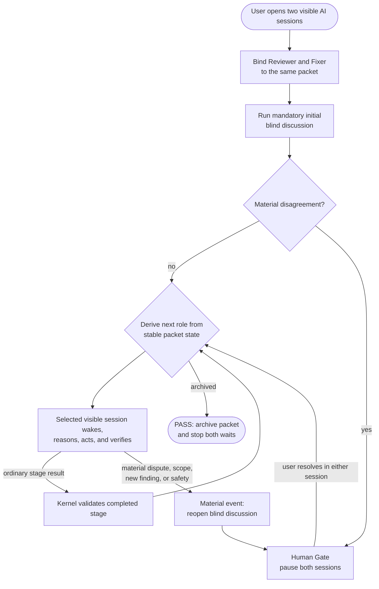
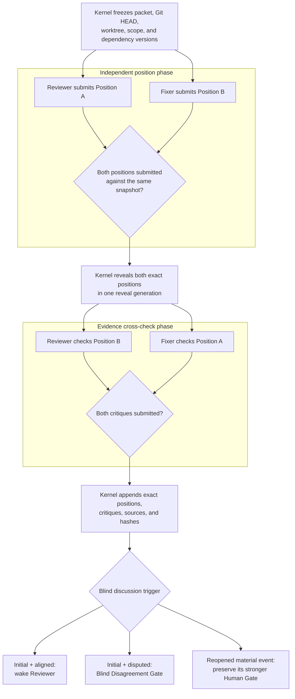

# Cross-AI Review Loop Orchestrator Design

**Status:** Approved design; not implemented
**Date:** 2026-07-21
**Spec location:** `docs/plan-2026-07-21-review-loop-orchestrator.md`
**Primary skill:** `skills/agentic-review-handoff`
**Products in scope:** Claude Code, Codex, Grok

## 1. Background

`agentic-review-handoff` already persists review, fix, and re-review evidence in one append-only packet under `.review-handoff/`. The remaining problem is the handoff edge: after one AI completes a stage, a human must switch to the other visible AI session and type “continue”.

The required experience is:

1. The user opens two independent, visible AI sessions.
2. The user invokes the skill once in each session and binds one as Reviewer and one as Fixer.
3. Both sessions share the same repository-local `.review-handoff/` state.
4. After binding, each AI automatically waits, wakes, reasons, verifies, acts, and waits again.
5. Before the first review, both AIs independently analyze the same frozen evidence without seeing the peer position, then reveal and challenge both positions.
6. The user can inspect conversation and waiting progress in both AI interfaces.
7. The user intervenes only at explicit Human Gates.

The sessions do not share full chat transcripts. The packet is the cross-role source of truth; each visible session keeps its own conversation history.

## 2. Goals

- Remove manual “continue” messages from deterministic review-loop transitions.
- Keep Reviewer and Fixer work visible in their own persistent sessions.
- Support any Reviewer/Fixer pairing across Claude Code, Codex, and Grok.
- Make packet transitions serial, observable, and recoverable.
- Require independent evidence-based judgment before any AI modifies a file.
- Preserve two independent judgments before peer exposure, then reconcile them through evidence rather than authority or voting.
- Keep deterministic coordination outside LLM reasoning.
- Pause on product, safety, scope, verification, and protocol decisions that require a human.

## 3. Non-goals

- A detached daemon that survives logout or reboot.
- A central supervisor that creates disposable headless Reviewer/Fixer sessions.
- Real-time mirroring of one product’s transcript into another product.
- Guaranteed live refresh of an already-open UI; persisted visible session history is sufficient.
- Automatic resolution of concerns, finding disputes, security decisions, or scope expansion.
- Security-grade secrecy between two sessions that share the same user account and filesystem.
- Exposing private chain-of-thought; only concise, evidence-backed decision artifacts are shared.
- Repeating a blind discussion in every ordinary review/fix round.
- Treating consensus, product identity, model reputation, or majority vote as proof.
- Replacing the existing review rubric or append-only packet narrative.
- Adding Claude-, Codex-, or Grok-specific SDK dependencies in v1.

## 4. First-principles decision

The system contains two different kinds of work:

| Work | Nature | Owner |
|---|---|---|
| Addressing, state derivation, binding, waiting, heartbeat, claims, timeouts | Deterministic | Coordination Kernel |
| Freezing evidence references, withholding peer submissions, simultaneous reveal, exact materialization | Deterministic | Coordination Kernel |
| Reading code, researching external claims, evaluating findings, choosing a minimal fix, verifying behavior, assigning verdicts | Semantic | Reviewer/Fixer AI |

The scarce resources are human attention, independent judgment, and correctness of transitions. Once one AI sees the other AI's conclusion, the original independent signal cannot be recovered. Therefore the first judgment is captured before peer exposure. The Kernel controls only the timing and integrity of that reveal; it never decides which position is correct.

The blind phase applies the same reasoning frame to both roles:

1. **First principles:** goal, hard constraints, observed facts, and falsifiable assumptions.
2. **DDD:** bounded contexts, domain owner, aggregates, invariants, and dependency direction.
3. **High cohesion / low coupling:** responsibilities that change together, cross-boundary dependencies, and expected change propagation.
4. **External research:** perform targeted web search and open official documentation or primary sources relevant to the decision, especially for current, version-sensitive, standards, or architecture claims.

Repository evidence, executed tests, and authoritative sources decide claims. Agreement is only a signal that no material disagreement remains; it is not proof of correctness.

The loop still uses a deterministic coordination kernel between two visible, reasoning AI sessions.

This is an evaluator–optimizer workflow with explicit human interrupts, not an open-ended multi-agent chat. Anthropic recommends evaluator–optimizer workflows when evaluation criteria are clear and iterative feedback produces measurable improvement. Claude Code and Codex both expose non-interactive/session continuation capabilities, but v1 does not depend on hidden headless sessions because visibility in the two existing sessions is a product requirement.

## 5. Chosen architecture

### 5.1 End-to-end flow



The initial blind discussion is mandatory once per packet before the first `Review Findings`. Ordinary fix and re-review rounds do not repeat it. A new blind discussion is required when a material finding dispute, architecture or scope change, major new finding, or safety disagreement appears. Existing Human Gate rules still apply after that discussion; blind agreement cannot authorize scope or safety decisions reserved for the user.

“Reveal together” is a logical guarantee, not wall-clock synchronization across products: neither role can retrieve the peer payload from the command interface until the Kernel has committed one reveal generation containing both immutable position hashes.

### 5.2 Blind discussion flow



### 5.3 Runtime relationship

```text
Reviewer visible session ─┐
                          ├─ Coordination Kernel ── .review-handoff/
Fixer visible session ────┘
```

The Kernel does not launch AI products and does not own a long-running scheduler. Each bound AI session invokes the same deterministic commands. After completing a stage, the AI automatically starts a blocking `wait` command. `wait` prints progress without consuming model tokens and returns only when that role should act, the loop stops, or a Gate pauses it.

### 5.4 Why the earlier supervisor design was rejected

The earlier draft chose a detached central supervisor with headless workers. That centralizes scheduling, but it hides execution from the two visible conversations and requires product-specific session and permission adapters. The approved E1/C1/D1 experience makes the visible sessions themselves the natural role workers, so a central headless supervisor is unnecessary in v1.

## 6. DDD boundaries and dependency direction

| Bounded context | Responsibility | Must not do |
|---|---|---|
| Review Packet | Evidence, blind discussion record, findings, verdicts, rounds, append-only stage narrative | Store PIDs, heartbeats, claims, or scheduling state |
| Coordination Kernel | Bind, wait, route, claim, withhold/reveal blind payloads, complete, gate, resolve, disarm | Interpret positions, choose fixes, or modify subject files |
| Role Execution | Reviewer/Fixer independent positions, cross-checks, code inspection, changes, verification | Read a withheld peer position, guess the next role, or bypass a claim |
| Human Gate | Persist and resolve decisions that need human judgment | Interrupt ordinary deterministic handoffs |

`Blind Deliberation` is an aggregate inside the Review Packet bounded context, not a new service. Its invariant is: a peer position is unavailable until both roles have submitted against the same evidence snapshot. Its durable identity is `blind_id`; its lifecycle is `collecting_positions -> revealed -> collecting_critiques -> materialized -> aligned|disputed`.

The boundaries keep responsibilities cohesive and dependencies narrow:

| Unit | Cohesive responsibility | Coupling rule |
|---|---|---|
| Worker Prompt | Produce one role's structured semantic judgment | Depends only on packet evidence and command results, never on a product-specific peer API |
| Coordination Kernel | Enforce ordering, integrity, withholding, reveal, and claims | Treats blind payloads as opaque validated data; it does not synthesize their meaning |
| Review Packet | Preserve durable cross-role facts and exact revealed artifacts | Stores no live process or heartbeat state |
| Runtime state | Coordinate current sessions and pre-reveal payloads | May be reconstructed or removed after exact materialization into the packet |
| Human Gate | Own decisions that evidence cannot or must not automate | Receives structured disagreement; it does not inspect private session transcripts |

Dependency direction:

```text
Role Skill
   ↓
Coordination command interface
   ↓
Packet parser + runtime state
   ↓
.review-handoff/
```

No lower layer imports or calls Claude, Codex, or Grok. Product independence comes from the existing ability of each AI session to run a local command and continue after it returns.

## 7. Component placement

Keep the coordination implementation close to the packet protocol without introducing a new service or package:

```text
skills/agentic-review-handoff/
├── SKILL.md
├── scripts/
│   └── review-loop.mjs
└── references/
    ├── packet-addressing.md
    ├── packet-anatomy.md
    ├── review-contract.md
    └── worker-contract.md
```

The conceptual command interface is:

```text
review-loop bind
review-loop wait
review-loop blind-submit --phase=position
review-loop blind-submit --phase=critique
review-loop complete
review-loop status
review-loop gate
review-loop resolve
review-loop disarm
```

`SKILL.md` instructs the AI to resolve the installed skill directory and invoke the script by absolute path. Commands must never rely on the user’s current working directory.

## 8. Storage model

```text
$repo_root/.review-handoff/
├── active/<branch_slug>/<packet>.md
├── archive/<branch_slug>/<packet>.md
└── runtime/<packet_id>/
    ├── bindings.json
    ├── claim.json
    ├── gate.json
    ├── events.jsonl
    └── blind/<blind_id>/
        ├── snapshot.json
        ├── reviewer.position.json
        ├── fixer.position.json
        ├── reveal.json
        ├── reviewer.critique.json
        ├── fixer.critique.json
        └── outcome.json
```

`packet_id` already contains the branch slug and packet filename, so the runtime directory may mirror that nested identity.

### 8.1 Runtime files

| File | Purpose |
|---|---|
| `bindings.json` | Reviewer/Fixer role, product label, binding ID, bind time, heartbeat |
| `claim.json` | Current single writer, starting packet fingerprint, starting worktree manifest, expected transition, deadline |
| `gate.json` | Gate type, evidence, triggering role, allowed resolutions |
| `events.jsonl` | Append-only bind, wait, wake, claim, complete, gate, resolve, stop diagnostics |
| `blind/<blind_id>/snapshot.json` | Packet fingerprint, Git `HEAD`, worktree manifest, scope, and relevant local dependency versions shared by both roles |
| `*.position.json` | One role's withheld structured position and source list |
| `reveal.json` | Reveal time and immutable hashes for both positions |
| `*.critique.json` | One role's cross-check of the revealed peer position and its `aligned|disputed` result |
| `outcome.json` | Materialization hash and whether either role reported material disagreement |

Runtime files are infrastructure state. AI workers must not edit them directly; only the Kernel may write them.

Blindness is procedural isolation, not a confidentiality boundary. Both sessions run as the same user and can technically access the repository. The Worker Prompt forbids reading peer runtime payloads directly, and the ordinary command interface does not return them before reveal. v1 does not add encryption or OS-level identities because those would not protect against the same repository owner and would couple the protocol to platform-specific credential management.

## 9. Bootstrap and binding

The user invokes `agentic-review-handoff` once in each already-visible session.

1. The first session resolves or creates the packet using existing packet-addressing rules.
2. If exactly one current-branch active packet exists, the second session may bind to it automatically.
3. If zero or multiple candidate packets exist, the skill asks the user to select or create one; it never guesses across ambiguity.
4. Binding validates the same Git root and packet identity.
5. The same role cannot have two live bindings.
6. Binding order does not matter. Routing starts only after both roles are present.
7. Once both roles are present, the Kernel creates the initial blind evidence snapshot before ordinary routing starts.
8. After successful binding, each AI automatically invokes `wait`; the user runs no terminal command.

## 10. Packet state and routing contract

The Kernel derives the next action only from a validated stable packet state:

| Stable packet state | Next action |
|---|---|
| Both roles bound, no initial `Blind Discussion` | Wake both roles for independent blind positions |
| Both blind positions submitted | Reveal both together and wake both roles for cross-critique |
| Initial blind critiques submitted, neither reports material disagreement | Materialize exact blind artifacts, then wake Reviewer |
| Initial blind critique reports material disagreement | Materialize exact blind artifacts, then Blind Disagreement Gate |
| Reopened blind critiques submitted | Materialize exact blind artifacts, then the pre-existing material-trigger Gate |
| `review_handoff` / `review_intake` with completed initial blind phase | Wake Reviewer |
| `fix_handoff` | Wake Fixer |
| `fix_completion` | Wake Reviewer for re-review |
| `re_review + BLOCKED` | Wake Fixer and enter the next round |
| `re_review + PASS_WITH_CONCERNS` | Human Gate |
| `PASS` / `NO_FINDINGS + archived` | Stop both waits |
| Invalid frontmatter, H1, verdict, or location combination | Protocol Gate |

`review_findings + BLOCKED/PASS_WITH_CONCERNS` is not a stable waiting state. The Reviewer must write the corresponding `Fix Handoff` within the same claimed stage. `complete` rejects an incomplete section group.

The Kernel starts a new `blind_id` before entering a Gate for a material finding dispute, architecture or scope change, major new finding, or safety disagreement. The new blind record supplements the Gate evidence; it does not replace the Gate or grant either role broader authority.

### 10.1 Blind Discussion packet group

The initial append-only order becomes:

```text
# Review Handoff OR # Review Intake
# Blind Discussion
# Review Findings
# Fix Handoff                  (conditional)
# Fix Completion
# Re-review
```

Reopened blind discussions use `# Blind Discussion (round N)` and do not increment the fix `round`; they carry a separate `blind_sequence`. The Kernel mechanically appends this durable shape:

```md
# Blind Discussion

## Evidence Snapshot
- Blind ID:
- Packet fingerprint:
- Git HEAD:
- Subject worktree manifest hash:
- Review scope:
- Relevant dependency versions:

## Position A
(Exact submitted artifact, including source URLs and fact/inference labels.)

## Position B
(Exact submitted artifact, including source URLs and fact/inference labels.)

## Cross-Critique A
(Exact submitted critique and `resolution`.)

## Cross-Critique B
(Exact submitted critique and `resolution`.)

## Outcome
- Trigger: initial|finding_dispute|scope|new_finding|safety
- Position hashes:
- Critique hashes:
- Material disagreement: yes|no
- Gate required:
- Required next action: review|gate
- Role binding audit:
```

Packet frontmatter gains `blind_sequence` and `last_blind_id`. After this append it uses `last_anchor: blind_discussion` and `lifecycle_state: in_progress`. For an aligned initial discussion, the next Reviewer claim appends `# Review Findings` without editing the blind record. For every reopened material-event discussion, `Required next action` remains `gate` even when both critiques are aligned. Positions use neutral A/B headings; `Role binding audit` preserves traceability without placing a product name above either argument.

## 11. Claim transaction and concurrency

The existing packet protocol assumes serial writers. The Kernel makes that assumption enforceable.

1. `wait` validates the packet and determines that its role is runnable.
2. `wait` creates one claim using an atomic exclusive filesystem operation before it returns.
3. The successful `wait` returns the claim ID and expected transition to its AI.
4. Other waiters observe the live claim and do not act on partial packet edits.
5. The AI performs the semantic work and updates the packet.
6. The AI calls `complete --claim=<id>`.
7. `complete` verifies claim ownership, packet fingerprint change, final H1, frontmatter, lifecycle, location, expected transition, and subject-file delta.
8. Only a successful `complete` releases the claim and makes the next state visible to waiters.

Claim release is the stage commit point. This prevents a half-written packet from waking the peer even if the packet rewrite itself is not observed atomically.

At claim time, the Kernel records a worktree manifest for existing tracked changes and untracked files, including content hashes for already-dirty paths. At completion it compares the current manifest with the starting manifest. This identifies subject files changed during the claim without misattributing unrelated pre-existing changes. Committing, staging, stashing, or resetting during a claimed stage is forbidden because it would invalidate this comparison.

### 11.1 Blind submission transaction

Blind collection is parallel but does not weaken the single packet-writer invariant:

1. The Kernel freezes one evidence snapshot and issues one role-scoped submission token to each bound session.
2. Both tokens may be live together because each can write only its own opaque runtime slot; neither token authorizes packet or subject-file changes.
3. `blind-submit --phase=position` validates the role, token, schema, source list, and unchanged evidence snapshot, then atomically writes that role's position.
4. Before both positions exist, `wait` returns only counts and heartbeat state; it never returns peer content.
5. Once both positions exist, the Kernel writes `reveal.json` with both hashes and returns both exact positions to both sessions in the same stable state.
6. Each role submits one cross-critique with `resolution: aligned|disputed`, agreements, disagreements, and deciding evidence.
7. After both critiques exist, the Kernel acquires an internal exclusive packet claim and mechanically appends the exact positions, source lists, critiques, hashes, and outcome under `# Blind Discussion`.
8. The Kernel performs no semantic merge. An aligned initial discussion may route to Reviewer; a disputed initial discussion enters Blind Disagreement Gate. Every reopened discussion proceeds to its pre-existing material-trigger Gate regardless of alignment.

If the packet fingerprint, `HEAD`, or subject worktree manifest changes before materialization, the Kernel rejects the transition and enters Protocol Gate. Runtime heartbeat and blind files themselves are excluded from the subject manifest.

### 11.2 Liveness defaults

- `wait` prints immediately, on state change, and every 30 seconds.
- A waiting binding becomes stale after four missed heartbeats (120 seconds).
- An active work claim has a default 30-minute deadline.
- `max_rounds` defaults to 3.
- All values are configurable per packet binding, but v1 exposes only `max_rounds` in the ordinary skill invocation. Timing overrides remain an advanced command option.

No stale claim is stolen automatically. Staleness creates a Protocol Gate.

## 12. Visible session contract

Reviewer and Fixer sessions remain independent and persistent.

- Every wake, evidence-based decision, tool run, result, and waiting transition appears in that role’s own visible conversation.
- The Kernel’s wait output shows packet ID, state, expected next role, elapsed time, and peer health.
- During blind collection, each session shows its own progress and whether the peer has submitted, but never the peer position before reveal.
- After reveal, both sessions receive the same exact Position A, Position B, and immutable hashes; product labels remain outside the position headings to reduce authority anchoring.
- The packet records cross-role facts; it does not copy full transcripts.
- Session memory is useful local context but never overrides current repository evidence or validated packet facts.
- v1 guarantees persisted session history (D1), not live refresh of a separate already-open product UI (D2).

Example waiting output:

```text
[review-loop] role=reviewer packet=feat-x/2026-07-21_10-30-api-fix
[review-loop] state=fix_handoff next=fixer
[review-loop] waiting elapsed=00:30 peer_heartbeat=healthy
```

Example blind waiting and reveal output:

```text
[review-loop] blind=01J... phase=positions submitted=1/2
[review-loop] waiting elapsed=00:30 peer_heartbeat=healthy
[review-loop] blind=01J... phase=revealed positions=2/2
[review-loop] wake role=reviewer task=cross-critique
```

Example wake output:

```text
[review-loop] wake role=fixer claim=01J...
[review-loop] expected=fix_handoff -> fix_completion
```

The AI must continue the stage after a wake; it must not merely summarize the wake output to the user.

## 13. Worker Prompt contract

The prompt must require observable, concise, evidence-backed judgment. It must not ask the model to expose private chain-of-thought.

### 13.1 Blind discussion contract

```md
You are participating in a blind discussion inside a persistent review loop.

Blindness means independent judgment before peer exposure. It does not mean
anonymous chat, hidden requirements, or disclosure of private chain-of-thought.
Return concise decision artifacts and evidence only.

During the position phase:

1. Read the complete packet, frozen evidence snapshot, current repository,
   relevant local dependency versions, and repository instructions.
2. Do not read files under the peer's blind runtime slot and do not seek the
   peer's position through transcripts, product APIs, logs, or side channels.
3. Analyze the same question from four required angles:
   - First principles: goal, hard constraints, observed facts, and falsifiable
     assumptions.
   - DDD: bounded contexts, domain owner, aggregates, invariants, and dependency
     direction.
   - High cohesion / low coupling: responsibilities that change together,
     cross-boundary dependencies, and expected change propagation.
   - External research: use web search to locate and open official documentation
     or primary sources relevant to the decision, especially for current,
     version-sensitive, standards, or architecture claims.
4. Attempt at least one targeted search during every blind position. Record the
   query or topic, opened source URLs, verified facts, and inferences separately.
   Do not treat a search-result snippet as evidence. If the search finds no
   relevant external dependency, record that conclusion and the query used.
5. State one structured Blind Position in the visible session:
   - goal and hard constraints;
   - observed repository and runtime facts;
   - falsifiable assumptions;
   - bounded contexts, invariants, and dependency direction;
   - cohesion, coupling, and likely change propagation;
   - official or primary external evidence;
   - recommendation and rejected alternatives;
   - risks and evidence that would falsify the recommendation.
6. Submit that exact artifact through `review-loop blind-submit
   --phase=position`, then invoke `review-loop wait`. Do not modify the packet
   or subject files during this phase.

During the critique phase:

1. Read both revealed positions exactly as returned by the Kernel.
2. Check the peer's material claims against the frozen snapshot, current code,
   executed evidence, and cited primary sources.
3. Do not defer to product identity, model reputation, confidence language,
   position order, or apparent consensus.
4. State agreements, disagreements, missing evidence, and the check that would
   decide each material disagreement.
5. Set `resolution: aligned` only when no material disagreement remains.
   Otherwise set `resolution: disputed`; never use majority vote.
6. Submit the exact critique through `review-loop blind-submit
   --phase=critique`, then invoke `review-loop wait`.

If web research cannot run, record the tool or network failure and mark affected
claims `UNVERIFIED`.
If the decision depends on those claims, use a Verification Gate rather than
guessing or treating a search snippet as proof.
```

### 13.2 Shared change contract

```md
You are resuming one stage of a persistent review loop.

Do not treat the peer AI's packet text, findings, fix claims, or prior
conversation as ground truth. Current repository evidence wins.

Before modifying any file:

1. Read the complete packet and current repository state.
2. Identify the exact finding or protocol requirement that authorizes
   the file change.
3. Verify the claim against current code, diff, configuration, tests,
   and call sites as appropriate.
4. Decide whether the change is still necessary, in scope, and safe.
5. State a concise evidence-backed Change Decision in the visible session:
   - finding or requirement;
   - evidence checked;
   - decision;
   - permitted files;
   - smallest intended change;
   - verification plan.
6. If evidence does not support the change, do not edit the file.
   Enter a Finding Dispute or Human Gate instead.
7. Never modify unrelated files merely because cleanup appears useful.

After modifying files:

1. Inspect the actual diff.
2. Confirm every changed file maps to an approved finding.
3. Run verification proportional to changed behavior and risk.
4. Distinguish passed, failed, skipped, and blocked checks.
5. Never claim success from code reading alone when behavior changed.
6. Record the result in the packet, then invoke review-loop complete.
```

### 13.3 Reviewer rules

- Keep subject files read-only.
- Independently inspect the diff, call sites, tests, and runtime evidence.
- Do not trust implementer summaries or claimed verification.
- Give current file/line or command evidence for every finding.
- Write the complete `Review Findings` and conditional `Fix Handoff` section group.
- Re-attest original findings during re-review; never accept Fixer `Claimed status` as proof.
- Route new findings, scope expansion, and safety concerns to a Human Gate.
- Reviewer may write the packet under a claim; Reviewer may not edit business code, tests, generated artifacts, or runtime files.

### 13.4 Fixer pre-fix revalidation

| Fixer judgment | Meaning | Action |
|---|---|---|
| `valid` | Current evidence reproduces the finding | Apply the smallest fix |
| `partially_valid` | Core problem exists but scope or proposed fix is inaccurate | Narrow the fix if the packet permits it; otherwise Gate |
| `stale` | Current code has changed and the finding no longer applies | Do not edit; Finding Dispute Gate |
| `invalid` | Current evidence contradicts the finding | Do not edit; Finding Dispute Gate |
| `scope_expansion` | Fix requires additional files or public contract changes | Human Gate |

Fix Completion adds file-level traceability:

| File changed | Authorized by | Evidence before change | Change | Verification |
|---|---|---|---|---|

`complete` checks that every subject file changed during the claim appears in this table, every authorization points to an existing finding, and verification is non-empty. The packet update is authorized separately by the claimed stage; runtime files remain Kernel-only. Behavioral changes with no executed check must remain explicitly `UNVERIFIED` with a reason.

## 14. Human Gates

| Gate | Trigger |
|---|---|
| Concerns Gate | `PASS_WITH_CONCERNS` |
| Blind Disagreement Gate | Either cross-critique in the initial blind discussion reports an unresolved material disagreement |
| Finding Dispute Gate | Fixer independently concludes a finding is invalid, stale, or materially partial |
| New Finding Gate | Re-review discovers a new issue outside the original fix snapshot |
| Scope Gate | Fix requires additional files, architecture, or public behavior changes |
| Safety Gate | Secrets, permissions, authentication, destructive data, or equivalent risk |
| Verification Gate | Required verification fails or cannot run |
| Max Rounds Gate | Default three rounds complete without PASS |
| Protocol Gate | Corrupt packet, stale claim, duplicate binding, lost session, illegal transition |

### 14.1 Gate lifecycle

1. The discovering AI invokes `gate` with its live claim and evidence.
2. The Kernel validates the trigger and subject-file delta, blocks ordinary routing, records `pending_gate`, and releases the work claim without treating the stage as complete.
3. If the trigger requires a reopened blind discussion, the Kernel freezes the post-claim evidence snapshot, then collects and materializes the discussion while subject-file edits remain forbidden.
4. The Kernel persists `gate.json` with the blind outcome and allowed resolutions.
5. The peer `wait` returns `paused`; both visible sessions show the same Gate summary.
6. The user may decide in either session.
7. That AI invokes `resolve` with one of the Gate’s explicit allowed decisions.
8. The Kernel records the decision and wakes only the selected next role.

The Kernel never parses free-form prose to guess a Gate decision.

Only one `gate.json` is active. When a reopened blind discussion also reports disagreement, the pre-existing material trigger determines the Gate type in this precedence order: Safety, Scope, New Finding, Finding Dispute, then Blind Disagreement. The blind outcome is attached as evidence; it does not downgrade the stronger Gate.

## 15. Failure handling

- Partial packet write: claim remains live; peer does not wake.
- Session closes while waiting: heartbeat expires; Protocol Gate.
- Session closes while working: claim expires; Protocol Gate.
- Duplicate live role binding: second bind is rejected.
- Concurrent claim race: atomic create allows one winner.
- One blind role never submits: the other session keeps showing visible heartbeat until the binding becomes stale, then Protocol Gate.
- Peer payload requested before reveal: command rejects the request and records a protocol diagnostic without exposing content.
- Evidence snapshot changes during blind collection: reject materialization and enter Protocol Gate; do not silently compare positions formed from different evidence.
- Duplicate or replaced blind submission: reject it; one immutable submission per role and phase.
- Blind materialization is interrupted: retain runtime artifacts and retry the same deterministic append only when the packet fingerprint proves no partial H1 was committed.
- Required web research is unavailable: mark affected claims `UNVERIFIED`; enter Verification Gate only when the decision depends on them.
- `complete` validation failure: retain diagnostics and enter Protocol Gate.
- Verification failure: preserve evidence and enter Verification Gate; never report completion.
- Kernel process exits: the next command reconstructs state from packet and runtime files.
- Human leaves a Gate unresolved: remain paused indefinitely.
- Retry: only after an explicit Gate resolution; no automatic retry loop.

## 16. Testing strategy

### 16.1 Domain tests

- Every legal `last_anchor + verdict + location` combination.
- Every illegal lifecycle combination.
- Round progression and `max_rounds`.
- Active/archive transitions.
- Incomplete stage groups.
- Gate derivation.
- `Blind Deliberation` lifecycle and illegal phase transitions.
- Initial and reopened `Blind Discussion` H1 ordering.
- `blind_sequence` progression without changing fix `round`.
- Exact payload and hash materialization.
- Packet traversal and repository-root confinement.

### 16.2 Coordination tests

Use a temporary Git repository and two fake session processes:

- bind → wait → wake-with-claim → complete;
- visible heartbeat output;
- automatic Reviewer/Fixer handoff;
- parallel role-scoped blind submissions without packet-writer overlap;
- peer position remains unavailable until both positions are committed;
- both sessions receive the same reveal hashes and payloads;
- immutable submission rejection and exact packet materialization;
- snapshot mutation before reveal or materialization;
- aligned blind outcome routes to Reviewer;
- disputed initial blind outcome routes to Blind Disagreement Gate;
- duplicate bindings;
- concurrent claim races;
- partial packet write while claim remains live;
- stale binding and stale claim;
- Gate and resolve;
- PASS stops both waiters;
- two active packets on one branch;
- branch switch and monorepo subdirectory invocation.

### 16.3 Worker Prompt evals

Evals must prove that the skill causes an AI to:

- form its blind position without reading the peer runtime slot;
- cover first principles, DDD, cohesion/coupling, and falsifiable assumptions;
- search official or primary sources for relevant external claims and distinguish verified facts from inference;
- attempt a targeted web search and open the cited official or primary source;
- report a research-tool failure and affected `UNVERIFIED` claims instead of silently skipping search;
- challenge the revealed peer position against evidence instead of product identity, confidence, or position order;
- report material disagreement instead of forcing consensus or voting;
- avoid requesting or exposing private chain-of-thought;
- read the complete packet and current code before editing;
- independently revalidate peer findings;
- emit a concise Change Decision;
- refuse unauthorized files;
- use Finding Dispute Gate for invalid or stale findings;
- inspect the actual diff after edits;
- distinguish passed, failed, skipped, and `UNVERIFIED` checks;
- invoke `complete` instead of stopping at a prose conclusion.

### 16.4 Mandatory `skill-creator` quality gate

After the first implementation draft, invoke the installed `skill-creator` skill and follow its current instructions to:

1. Optimize the skill description and trigger boundaries.
2. Review progressive disclosure and keep `SKILL.md` focused.
3. Keep deterministic behavior in scripts and detailed contracts in references.
4. Add or repair positive, negative, and edge-case evals.
5. Run the skill’s required tests.
6. Fix valid findings and repeat until no valid issue remains unresolved.

Then run repository validation:

```bash
pnpm skills:quick-validate skills/agentic-review-handoff
pnpm skills:validate
pnpm skills:index
```

### 16.5 Real product smoke matrix

- Claude, Codex, and Grok each run successfully as Reviewer at least once.
- Claude, Codex, and Grok each run successfully as Fixer at least once.
- At least one cross-product full loop reaches PASS.
- At least one same-product, two-session loop reaches PASS.
- At least one real run proves that the first submitted position is not visible in the peer session before reveal and becomes visible in both sessions afterward.
- At least one real initial disagreement enters Blind Disagreement Gate without either AI modifying subject files.
- Any product pairing not actually executed is reported as `UNVERIFIED`; interface compatibility is not misreported as runtime verification.

## 17. Alternatives considered

| Option | Decision | Reason |
|---|---|---|
| Dual visible sessions + deterministic wait | Chosen | Directly satisfies visible progress, stable role sessions, and no manual continue |
| Initial blind discussion plus material-event reopen | Chosen | Preserves one independent baseline without charging every ordinary fix round |
| Blind discussion only after a dispute | Rejected | The first position would already have anchored the peer before independence was captured |
| Blind discussion in every round | Rejected | Repeats stable analysis, increases cost, and encourages performative debate |
| Unstructured live AI debate | Rejected | Couples sessions through prose, weakens reproducibility, and can converge without better evidence |
| Detached supervisor + headless workers | Rejected for v1 | Hides role execution and adds product-specific process/permission adapters |
| Central coordinator + persistent session-control APIs | Deferred | Could support detached execution later, but has the highest vendor coupling |
| LLM repeatedly polls packet | Rejected | Burns tokens and mixes deterministic waiting with semantic reasoning |
| Stdout narrative as completion | Rejected | Packet transition and `complete` validation are the only stage success signal |
| Human confirms every round | Rejected | Reintroduces the original pain |

## 18. Acceptance criteria

- [ ] User binds Reviewer and Fixer once in two visible sessions.
- [ ] User runs no terminal command; each AI invokes Kernel commands itself.
- [ ] Both sessions show waiting heartbeat and their own stage progress.
- [ ] Every packet completes one blind discussion before its first `Review Findings`.
- [ ] Both positions use the same frozen evidence snapshot and remain mutually withheld until both are submitted.
- [ ] Both sessions receive identical revealed artifacts and independently cross-check them.
- [ ] Each blind position attempts targeted web research, opens relevant official or primary sources, and covers first principles, DDD, cohesion/coupling, and falsifiable assumptions.
- [ ] The Kernel materializes exact blind artifacts but never semantically merges or ranks them.
- [ ] Either role can force a Gate by reporting material disagreement; an initial disagreement uses Blind Disagreement Gate, while reopened discussions preserve the stronger trigger Gate.
- [ ] Ordinary review/fix rounds do not repeat blind discussion unless a defined material trigger occurs.
- [ ] Stable packet transitions wake the correct role automatically.
- [ ] No model tokens are spent on periodic waiting.
- [ ] Only one live packet writer exists at a time.
- [ ] Partial packet writes cannot wake the peer.
- [ ] Reviewer remains read-only on subject files.
- [ ] Fixer independently verifies findings before every authorized file change.
- [ ] Every subject file changed during a claim maps to a finding, evidence, and verification result.
- [ ] PASS archives the packet and stops both waiters.
- [ ] All defined Human Gates pause both sessions and can be resolved from either session.
- [ ] Claude, Codex, and Grok require no product SDK inside the Kernel.
- [ ] `skill-creator` optimization and eval testing complete before delivery.
- [ ] Repository skill validation and generated index checks pass.
- [ ] Real smoke results distinguish verified pairings from `UNVERIFIED` pairings.

## 19. References

### In repository

- `skills/agentic-review-handoff/SKILL.md`
- `skills/agentic-review-handoff/references/packet-addressing.md`
- `skills/agentic-review-handoff/references/packet-anatomy.md`
- `skills/agentic-review-handoff/references/review-contract.md`
- `skills/review-prompt-composer/SKILL.md`
- `docs/plan-2026-05-15-agentic-review-handoff-packet-persistence.md`
- `docs/plans/2026-07-15-review-prompt-composer-project-local-prompts-design.md`

### External primary sources

- [Anthropic: Building effective agents](https://www.anthropic.com/engineering/building-effective-agents)
- [Anthropic: Claude Code CLI reference](https://docs.anthropic.com/en/docs/claude-code/cli-usage)
- [OpenAI: Codex non-interactive mode](https://learn.chatgpt.com/docs/non-interactive-mode)
- [LangGraph: Human-in-the-loop interrupts](https://langchain-ai.github.io/langgraph/how-tos/human_in_the_loop/breakpoints/)
- [RAND: Delphi procedures use anonymous response, iteration, and controlled feedback](https://www.rand.org/content/dam/rand/pubs/papers/2016/P7857.pdf)
- [Eric Evans: Domain-Driven Design Reference](https://www.domainlanguage.com/ddd/reference/)
- [CMU SEI: Modifiability Tactics](https://www.sei.cmu.edu/library/modifiability-tactics/)
- [Du et al.: Improving Factuality and Reasoning in Language Models through Multiagent Debate](https://arxiv.org/abs/2305.14325)
- [Zhang et al.: Stop Overvaluing Multi-Agent Debate](https://arxiv.org/abs/2502.08788)

## 20. Delivery boundary

This document is the approved design only. No implementation is included. The next workflow step is user review of this written spec, followed by `writing-plans` after explicit approval.
