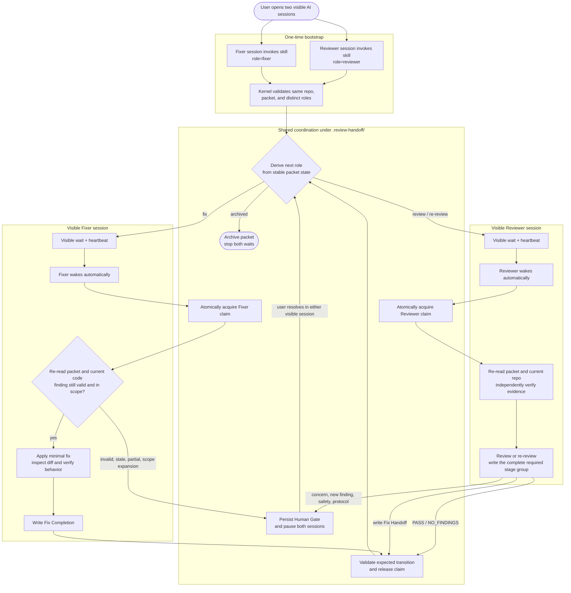

# Cross-AI Review Loop Orchestrator Design

**Status:** Approved design; not implemented
**Date:** 2026-07-21
**Spec location:** `docs/plan-2026-07-21-review-loop-orchestrator.md`
**Primary skill:** `skills/agentic-review-handoff`
**Products in scope:** Claude Code, Codex, Grok

## 1. Background

`agentic-review-handoff` already persists review, fix, and re-review evidence in one append-only packet under `.review-handoff/`. The remaining problem is the handoff edge: after one AI completes a stage, a human must switch to the other visible AI session and type “continue”.

The required experience is:

1. The user opens two independent, visible AI sessions.
2. The user invokes the skill once in each session and binds one as Reviewer and one as Fixer.
3. Both sessions share the same repository-local `.review-handoff/` state.
4. After binding, each AI automatically waits, wakes, reasons, verifies, acts, and waits again.
5. The user can inspect conversation and waiting progress in both AI interfaces.
6. The user intervenes only at explicit Human Gates.

The sessions do not share full chat transcripts. The packet is the cross-role source of truth; each visible session keeps its own conversation history.

## 2. Goals

- Remove manual “continue” messages from deterministic review-loop transitions.
- Keep Reviewer and Fixer work visible in their own persistent sessions.
- Support any Reviewer/Fixer pairing across Claude Code, Codex, and Grok.
- Make packet transitions serial, observable, and recoverable.
- Require independent evidence-based judgment before any AI modifies a file.
- Keep deterministic coordination outside LLM reasoning.
- Pause on product, safety, scope, verification, and protocol decisions that require a human.

## 3. Non-goals

- A detached daemon that survives logout or reboot.
- A central supervisor that creates disposable headless Reviewer/Fixer sessions.
- Real-time mirroring of one product’s transcript into another product.
- Guaranteed live refresh of an already-open UI; persisted visible session history is sufficient.
- Automatic resolution of concerns, finding disputes, security decisions, or scope expansion.
- Replacing the existing review rubric or append-only packet narrative.
- Adding Claude-, Codex-, or Grok-specific SDK dependencies in v1.

## 4. First-principles decision

The system contains two different kinds of work:

| Work | Nature | Owner |
|---|---|---|
| Addressing, state derivation, binding, waiting, heartbeat, claims, timeouts | Deterministic | Coordination Kernel |
| Reading code, evaluating findings, choosing a minimal fix, verifying behavior, assigning verdicts | Semantic | Reviewer/Fixer AI |

The scarce resources are human attention and correctness of transitions. The loop has code-defined edges but judgment-heavy nodes. Therefore v1 uses a deterministic coordination kernel between two visible, reasoning AI sessions.

This is an evaluator–optimizer workflow with explicit human interrupts, not an open-ended multi-agent chat. Anthropic recommends evaluator–optimizer workflows when evaluation criteria are clear and iterative feedback produces measurable improvement. Claude Code and Codex both expose non-interactive/session continuation capabilities, but v1 does not depend on hidden headless sessions because visibility in the two existing sessions is a product requirement.

## 5. Chosen architecture

### 5.1 End-to-end flow



### 5.2 Runtime relationship

```text
Reviewer visible session ─┐
                          ├─ Coordination Kernel ── .review-handoff/
Fixer visible session ────┘
```

The Kernel does not launch AI products and does not own a long-running scheduler. Each bound AI session invokes the same deterministic commands. After completing a stage, the AI automatically starts a blocking `wait` command. `wait` prints progress without consuming model tokens and returns only when that role should act, the loop stops, or a Gate pauses it.

### 5.3 Why the earlier supervisor design was rejected

The earlier draft chose a detached central supervisor with headless workers. That centralizes scheduling, but it hides execution from the two visible conversations and requires product-specific session and permission adapters. The approved E1/C1/D1 experience makes the visible sessions themselves the natural role workers, so a central headless supervisor is unnecessary in v1.

## 6. DDD boundaries and dependency direction

| Bounded context | Responsibility | Must not do |
|---|---|---|
| Review Packet | Evidence, findings, verdicts, rounds, append-only stage narrative | Store PIDs, heartbeats, claims, or scheduling state |
| Coordination Kernel | Bind, wait, route, claim, complete, gate, resolve, disarm | Write findings, choose fixes, or modify subject files |
| Role Execution | Reviewer/Fixer reasoning, code inspection, changes, verification | Guess the next role or bypass a claim |
| Human Gate | Persist and resolve decisions that need human judgment | Interrupt ordinary deterministic handoffs |

Dependency direction:

```text
Role Skill
   ↓
Coordination command interface
   ↓
Packet parser + runtime state
   ↓
.review-handoff/
```

No lower layer imports or calls Claude, Codex, or Grok. Product independence comes from the existing ability of each AI session to run a local command and continue after it returns.

## 7. Component placement

Keep the coordination implementation close to the packet protocol without introducing a new service or package:

```text
skills/agentic-review-handoff/
├── SKILL.md
├── scripts/
│   └── review-loop.mjs
└── references/
    ├── packet-addressing.md
    ├── packet-anatomy.md
    ├── review-contract.md
    └── worker-contract.md
```

The conceptual command interface is:

```text
review-loop bind
review-loop wait
review-loop complete
review-loop status
review-loop gate
review-loop resolve
review-loop disarm
```

`SKILL.md` instructs the AI to resolve the installed skill directory and invoke the script by absolute path. Commands must never rely on the user’s current working directory.

## 8. Storage model

```text
$repo_root/.review-handoff/
├── active/<branch_slug>/<packet>.md
├── archive/<branch_slug>/<packet>.md
└── runtime/<packet_id>/
    ├── bindings.json
    ├── claim.json
    ├── gate.json
    └── events.jsonl
```

`packet_id` already contains the branch slug and packet filename, so the runtime directory may mirror that nested identity.

### 8.1 Runtime files

| File | Purpose |
|---|---|
| `bindings.json` | Reviewer/Fixer role, product label, binding ID, bind time, heartbeat |
| `claim.json` | Current single writer, starting packet fingerprint, starting worktree manifest, expected transition, deadline |
| `gate.json` | Gate type, evidence, triggering role, allowed resolutions |
| `events.jsonl` | Append-only bind, wait, wake, claim, complete, gate, resolve, stop diagnostics |

Runtime files are infrastructure state. AI workers must not edit them directly; only the Kernel may write them.

## 9. Bootstrap and binding

The user invokes `agentic-review-handoff` once in each already-visible session.

1. The first session resolves or creates the packet using existing packet-addressing rules.
2. If exactly one current-branch active packet exists, the second session may bind to it automatically.
3. If zero or multiple candidate packets exist, the skill asks the user to select or create one; it never guesses across ambiguity.
4. Binding validates the same Git root and packet identity.
5. The same role cannot have two live bindings.
6. Binding order does not matter. Routing starts only after both roles are present.
7. After successful binding, each AI automatically invokes `wait`; the user runs no terminal command.

## 10. Packet state and routing contract

The Kernel derives the next action only from a validated stable packet state:

| Stable packet state | Next action |
|---|---|
| `review_handoff` / `review_intake` | Wake Reviewer |
| `fix_handoff` | Wake Fixer |
| `fix_completion` | Wake Reviewer for re-review |
| `re_review + BLOCKED` | Wake Fixer and enter the next round |
| `re_review + PASS_WITH_CONCERNS` | Human Gate |
| `PASS` / `NO_FINDINGS + archived` | Stop both waits |
| Invalid frontmatter, H1, verdict, or location combination | Protocol Gate |

`review_findings + BLOCKED/PASS_WITH_CONCERNS` is not a stable waiting state. The Reviewer must write the corresponding `Fix Handoff` within the same claimed stage. `complete` rejects an incomplete section group.

## 11. Claim transaction and concurrency

The existing packet protocol assumes serial writers. The Kernel makes that assumption enforceable.

1. `wait` validates the packet and determines that its role is runnable.
2. `wait` creates one claim using an atomic exclusive filesystem operation before it returns.
3. The successful `wait` returns the claim ID and expected transition to its AI.
4. Other waiters observe the live claim and do not act on partial packet edits.
5. The AI performs the semantic work and updates the packet.
6. The AI calls `complete --claim=<id>`.
7. `complete` verifies claim ownership, packet fingerprint change, final H1, frontmatter, lifecycle, location, expected transition, and subject-file delta.
8. Only a successful `complete` releases the claim and makes the next state visible to waiters.

Claim release is the stage commit point. This prevents a half-written packet from waking the peer even if the packet rewrite itself is not observed atomically.

At claim time, the Kernel records a worktree manifest for existing tracked changes and untracked files, including content hashes for already-dirty paths. At completion it compares the current manifest with the starting manifest. This identifies subject files changed during the claim without misattributing unrelated pre-existing changes. Committing, staging, stashing, or resetting during a claimed stage is forbidden because it would invalidate this comparison.

### 11.1 Liveness defaults

- `wait` prints immediately, on state change, and every 30 seconds.
- A waiting binding becomes stale after four missed heartbeats (120 seconds).
- An active work claim has a default 30-minute deadline.
- `max_rounds` defaults to 3.
- All values are configurable per packet binding, but v1 exposes only `max_rounds` in the ordinary skill invocation. Timing overrides remain an advanced command option.

No stale claim is stolen automatically. Staleness creates a Protocol Gate.

## 12. Visible session contract

Reviewer and Fixer sessions remain independent and persistent.

- Every wake, evidence-based decision, tool run, result, and waiting transition appears in that role’s own visible conversation.
- The Kernel’s wait output shows packet ID, state, expected next role, elapsed time, and peer health.
- The packet records cross-role facts; it does not copy full transcripts.
- Session memory is useful local context but never overrides current repository evidence or validated packet facts.
- v1 guarantees persisted session history (D1), not live refresh of a separate already-open product UI (D2).

Example waiting output:

```text
[review-loop] role=reviewer packet=feat-x/2026-07-21_10-30-api-fix
[review-loop] state=fix_handoff next=fixer
[review-loop] waiting elapsed=00:30 peer_heartbeat=healthy
```

Example wake output:

```text
[review-loop] wake role=fixer claim=01J...
[review-loop] expected=fix_handoff -> fix_completion
```

The AI must continue the stage after a wake; it must not merely summarize the wake output to the user.

## 13. Worker Prompt contract

The prompt must require observable, concise, evidence-backed judgment. It must not ask the model to expose private chain-of-thought.

### 13.1 Shared contract

```md
You are resuming one stage of a persistent review loop.

Do not treat the peer AI's packet text, findings, fix claims, or prior
conversation as ground truth. Current repository evidence wins.

Before modifying any file:

1. Read the complete packet and current repository state.
2. Identify the exact finding or protocol requirement that authorizes
   the file change.
3. Verify the claim against current code, diff, configuration, tests,
   and call sites as appropriate.
4. Decide whether the change is still necessary, in scope, and safe.
5. State a concise evidence-backed Change Decision in the visible session:
   - finding or requirement;
   - evidence checked;
   - decision;
   - permitted files;
   - smallest intended change;
   - verification plan.
6. If evidence does not support the change, do not edit the file.
   Enter a Finding Dispute or Human Gate instead.
7. Never modify unrelated files merely because cleanup appears useful.

After modifying files:

1. Inspect the actual diff.
2. Confirm every changed file maps to an approved finding.
3. Run verification proportional to changed behavior and risk.
4. Distinguish passed, failed, skipped, and blocked checks.
5. Never claim success from code reading alone when behavior changed.
6. Record the result in the packet, then invoke review-loop complete.
```

### 13.2 Reviewer rules

- Keep subject files read-only.
- Independently inspect the diff, call sites, tests, and runtime evidence.
- Do not trust implementer summaries or claimed verification.
- Give current file/line or command evidence for every finding.
- Write the complete `Review Findings` and conditional `Fix Handoff` section group.
- Re-attest original findings during re-review; never accept Fixer `Claimed status` as proof.
- Route new findings, scope expansion, and safety concerns to a Human Gate.
- Reviewer may write the packet under a claim; Reviewer may not edit business code, tests, generated artifacts, or runtime files.

### 13.3 Fixer pre-fix revalidation

| Fixer judgment | Meaning | Action |
|---|---|---|
| `valid` | Current evidence reproduces the finding | Apply the smallest fix |
| `partially_valid` | Core problem exists but scope or proposed fix is inaccurate | Narrow the fix if the packet permits it; otherwise Gate |
| `stale` | Current code has changed and the finding no longer applies | Do not edit; Finding Dispute Gate |
| `invalid` | Current evidence contradicts the finding | Do not edit; Finding Dispute Gate |
| `scope_expansion` | Fix requires additional files or public contract changes | Human Gate |

Fix Completion adds file-level traceability:

| File changed | Authorized by | Evidence before change | Change | Verification |
|---|---|---|---|---|

`complete` checks that every subject file changed during the claim appears in this table, every authorization points to an existing finding, and verification is non-empty. The packet update is authorized separately by the claimed stage; runtime files remain Kernel-only. Behavioral changes with no executed check must remain explicitly `UNVERIFIED` with a reason.

## 14. Human Gates

| Gate | Trigger |
|---|---|
| Concerns Gate | `PASS_WITH_CONCERNS` |
| Finding Dispute Gate | Fixer independently concludes a finding is invalid, stale, or materially partial |
| New Finding Gate | Re-review discovers a new issue outside the original fix snapshot |
| Scope Gate | Fix requires additional files, architecture, or public behavior changes |
| Safety Gate | Secrets, permissions, authentication, destructive data, or equivalent risk |
| Verification Gate | Required verification fails or cannot run |
| Max Rounds Gate | Default three rounds complete without PASS |
| Protocol Gate | Corrupt packet, stale claim, duplicate binding, lost session, illegal transition |

### 14.1 Gate lifecycle

1. The discovering AI invokes `gate` with its live claim and evidence.
2. The Kernel validates the Gate, releases the claim, and persists `gate.json`.
3. The peer `wait` returns `paused`; both visible sessions show the same Gate summary.
4. The user may decide in either session.
5. That AI invokes `resolve` with one of the Gate’s explicit allowed decisions.
6. The Kernel records the decision and wakes only the selected next role.

The Kernel never parses free-form prose to guess a Gate decision.

## 15. Failure handling

- Partial packet write: claim remains live; peer does not wake.
- Session closes while waiting: heartbeat expires; Protocol Gate.
- Session closes while working: claim expires; Protocol Gate.
- Duplicate live role binding: second bind is rejected.
- Concurrent claim race: atomic create allows one winner.
- `complete` validation failure: retain diagnostics and enter Protocol Gate.
- Verification failure: preserve evidence and enter Verification Gate; never report completion.
- Kernel process exits: the next command reconstructs state from packet and runtime files.
- Human leaves a Gate unresolved: remain paused indefinitely.
- Retry: only after an explicit Gate resolution; no automatic retry loop.

## 16. Testing strategy

### 16.1 Domain tests

- Every legal `last_anchor + verdict + location` combination.
- Every illegal lifecycle combination.
- Round progression and `max_rounds`.
- Active/archive transitions.
- Incomplete stage groups.
- Gate derivation.
- Packet traversal and repository-root confinement.

### 16.2 Coordination tests

Use a temporary Git repository and two fake session processes:

- bind → wait → wake-with-claim → complete;
- visible heartbeat output;
- automatic Reviewer/Fixer handoff;
- duplicate bindings;
- concurrent claim races;
- partial packet write while claim remains live;
- stale binding and stale claim;
- Gate and resolve;
- PASS stops both waiters;
- two active packets on one branch;
- branch switch and monorepo subdirectory invocation.

### 16.3 Worker Prompt evals

Evals must prove that the skill causes an AI to:

- read the complete packet and current code before editing;
- independently revalidate peer findings;
- emit a concise Change Decision;
- refuse unauthorized files;
- use Finding Dispute Gate for invalid or stale findings;
- inspect the actual diff after edits;
- distinguish passed, failed, skipped, and `UNVERIFIED` checks;
- invoke `complete` instead of stopping at a prose conclusion.

### 16.4 Mandatory `skill-creator` quality gate

After the first implementation draft, invoke the installed `skill-creator` skill and follow its current instructions to:

1. Optimize the skill description and trigger boundaries.
2. Review progressive disclosure and keep `SKILL.md` focused.
3. Keep deterministic behavior in scripts and detailed contracts in references.
4. Add or repair positive, negative, and edge-case evals.
5. Run the skill’s required tests.
6. Fix valid findings and repeat until no valid issue remains unresolved.

Then run repository validation:

```bash
pnpm skills:quick-validate skills/agentic-review-handoff
pnpm skills:validate
pnpm skills:index
```

### 16.5 Real product smoke matrix

- Claude, Codex, and Grok each run successfully as Reviewer at least once.
- Claude, Codex, and Grok each run successfully as Fixer at least once.
- At least one cross-product full loop reaches PASS.
- At least one same-product, two-session loop reaches PASS.
- Any product pairing not actually executed is reported as `UNVERIFIED`; interface compatibility is not misreported as runtime verification.

## 17. Alternatives considered

| Option | Decision | Reason |
|---|---|---|
| Dual visible sessions + deterministic wait | Chosen | Directly satisfies visible progress, stable role sessions, and no manual continue |
| Detached supervisor + headless workers | Rejected for v1 | Hides role execution and adds product-specific process/permission adapters |
| Central coordinator + persistent session-control APIs | Deferred | Could support detached execution later, but has the highest vendor coupling |
| LLM repeatedly polls packet | Rejected | Burns tokens and mixes deterministic waiting with semantic reasoning |
| Stdout narrative as completion | Rejected | Packet transition and `complete` validation are the only stage success signal |
| Human confirms every round | Rejected | Reintroduces the original pain |

## 18. Acceptance criteria

- [ ] User binds Reviewer and Fixer once in two visible sessions.
- [ ] User runs no terminal command; each AI invokes Kernel commands itself.
- [ ] Both sessions show waiting heartbeat and their own stage progress.
- [ ] Stable packet transitions wake the correct role automatically.
- [ ] No model tokens are spent on periodic waiting.
- [ ] Only one live packet writer exists at a time.
- [ ] Partial packet writes cannot wake the peer.
- [ ] Reviewer remains read-only on subject files.
- [ ] Fixer independently verifies findings before every authorized file change.
- [ ] Every subject file changed during a claim maps to a finding, evidence, and verification result.
- [ ] PASS archives the packet and stops both waiters.
- [ ] All defined Human Gates pause both sessions and can be resolved from either session.
- [ ] Claude, Codex, and Grok require no product SDK inside the Kernel.
- [ ] `skill-creator` optimization and eval testing complete before delivery.
- [ ] Repository skill validation and generated index checks pass.
- [ ] Real smoke results distinguish verified pairings from `UNVERIFIED` pairings.

## 19. References

### In repository

- `skills/agentic-review-handoff/SKILL.md`
- `skills/agentic-review-handoff/references/packet-addressing.md`
- `skills/agentic-review-handoff/references/packet-anatomy.md`
- `skills/agentic-review-handoff/references/review-contract.md`
- `skills/review-prompt-composer/SKILL.md`
- `docs/plan-2026-05-15-agentic-review-handoff-packet-persistence.md`
- `docs/plans/2026-07-15-review-prompt-composer-project-local-prompts-design.md`

### External primary sources

- [Anthropic: Building effective agents](https://www.anthropic.com/engineering/building-effective-agents)
- [Anthropic: Claude Code CLI reference](https://docs.anthropic.com/en/docs/claude-code/cli-usage)
- [OpenAI: Codex non-interactive mode](https://learn.chatgpt.com/docs/non-interactive-mode)
- [LangGraph: Human-in-the-loop interrupts](https://langchain-ai.github.io/langgraph/how-tos/human_in_the_loop/breakpoints/)

## 20. Delivery boundary

This document is the approved design only. No implementation is included. The next workflow step is user review of this written spec, followed by `writing-plans` after explicit approval.
