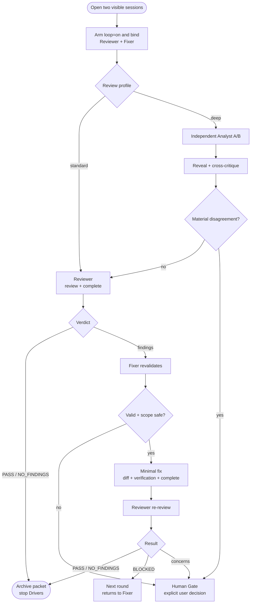
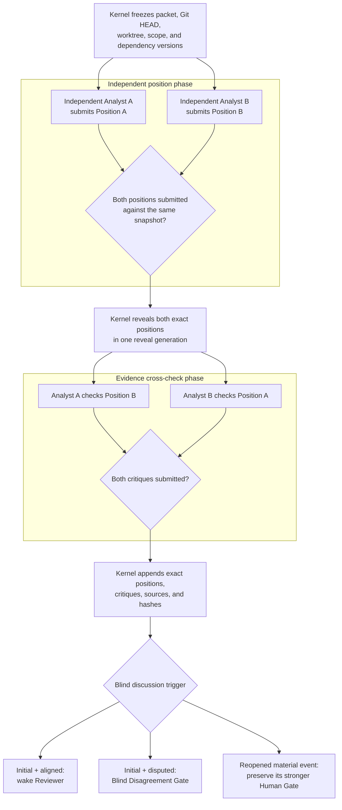

# Cross-AI Review Loop Orchestrator Design

**Status:** Partial implementation + dogfood — **structural issues confirmed; redesign discussion open** (see §21)
**Date:** 2026-07-21 (spec) · **Dogfood notes:** 2026-07-21 evening – 2026-07-22
**Spec location:** `docs/plan-2026-07-21-review-loop-orchestrator.md`
**Primary skill:** `skills/agentic-review-handoff`
**Products in scope:** Claude Code, Codex, Grok
**Impl snapshot:** Kernel CLI under `skills/agentic-review-handoff/scripts/review-loop/` (skill ~v2.5: `open` / `board` / `append-eof` / `summary`); **not** acceptance of this plan’s full criteria

## 1. Background

`agentic-review-handoff` already persists review, fix, and re-review evidence in one append-only packet under `.review-handoff/`. The remaining problem is the handoff edge: after one AI completes a stage, a human must switch to the other visible AI session and type “continue”.

When automated `loop=on` mode is armed, the required experience is:

1. The user opens two independent, visible AI sessions.
2. The user invokes the skill once in each session and binds one as Reviewer and one as Fixer.
3. Both sessions share the same repository-local `.review-handoff/` state.
4. After binding, each AI automatically waits, wakes, reasons, verifies, acts, and waits again.
5. In `profile=deep`, both AIs independently analyze the same frozen evidence before the first review, then reveal and challenge both positions.
6. The user can inspect conversation and waiting progress in both AI interfaces.
7. The user intervenes only at explicit Human Gates.

The sessions do not share full chat transcripts. The packet is the cross-role source of truth; each visible session keeps its own conversation history.

## 2. Goals

- Remove manual “continue” messages from deterministic review-loop transitions.
- Keep Reviewer and Fixer work visible in their own persistent sessions.
- Support any Reviewer/Fixer pairing across Claude Code, Codex, and Grok.
- Make packet transitions serial, observable, and recoverable.
- Require independent evidence-based judgment before any AI modifies a file.
- Preserve two independent judgments before peer exposure when `profile=deep` is explicitly armed, then reconcile them through evidence rather than authority or voting.
- Keep deterministic coordination outside LLM reasoning.
- Pause on product, safety, scope, verification, and protocol decisions that require a human.
- Preserve the existing single-session packet workflow when automated loop mode is not armed.

## 3. Non-goals

- A detached daemon that survives logout or reboot.
- An automatic switch to hidden headless Reviewer/Fixer sessions when visible-session feasibility fails.
- Real-time mirroring of one product’s transcript into another product.
- Guaranteed live refresh of an already-open UI; persisted visible session history is sufficient.
- Automatic resolution of concerns, finding disputes, security decisions, or scope expansion.
- Security-grade secrecy between two sessions that share the same user account and filesystem.
- Exposing private chain-of-thought; only concise, evidence-backed decision artifacts are shared.
- Repeating a blind discussion in every ordinary review/fix round.
- Making blind deliberation or mandatory web research a structural dependency of the standard orchestration loop.
- Treating consensus, product identity, model reputation, or majority vote as proof.
- Replacing the existing review rubric or append-only packet narrative.
- Adding Claude-, Codex-, or Grok-specific SDK dependencies in v1.

The current single-session `agentic-review-handoff` path remains supported. Dual binding and automatic routing activate only when the user arms `loop=on`; blind deliberation activates only under `profile=deep`. Runtime selection is explicit and never silently changes from visible sessions to headless execution.

## 4. First-principles decision

The system contains four different kinds of work:

| Work                                                                                                                                    | Nature                                 | Owner                             |
| --------------------------------------------------------------------------------------------------------------------------------------- | -------------------------------------- | --------------------------------- |
| Addressing, state derivation, binding, routing, claims, fencing, gates, completion                                                      | Deterministic domain/application logic | Review Orchestration Kernel       |
| Waiting, heartbeat, wake, resume, cancellation, product-session health                                                                  | Product-specific infrastructure        | Session Runtime Driver            |
| Reading code, researching relevant external claims, evaluating findings, choosing a minimal fix, verifying behavior, assigning verdicts | Semantic                               | Reviewer/Fixer AI                 |
| Freezing evidence, withholding peer submissions, simultaneous reveal, exact materialization                                             | Optional deterministic policy support  | Deep Deliberation Policy + Kernel |

The scarce resources are human attention, runtime reliability, independent judgment, and correctness of transitions. Every automated loop needs reliable transitions; not every loop needs the cost of two independent positions and two critiques. Therefore orchestration is the mandatory core and blind deliberation is a selectable quality policy.

When `profile=deep` is armed, the blind phase applies the same reasoning frame to both roles:

1. **First principles:** goal, hard constraints, observed facts, and falsifiable assumptions.
2. **DDD:** bounded contexts, domain owner, aggregates, invariants, and dependency direction.
3. **High cohesion / low coupling:** responsibilities that change together, cross-boundary dependencies, and expected change propagation.
4. **External research:** perform at least one targeted search and open official documentation or primary sources relevant to the decision.

Under `profile=standard`, external research is risk-triggered for current, version-sensitive, standards, unfamiliar-library, or architecture claims. Repository evidence, executed tests, and authoritative sources decide claims in both profiles. Agreement is only a signal that no material disagreement remains; it is not proof of correctness.

The loop still uses a deterministic coordination kernel between two visible, reasoning AI sessions.

This is an evaluator–optimizer workflow with explicit human interrupts, not an open-ended multi-agent chat. Anthropic recommends evaluator–optimizer workflows when evaluation criteria are clear and iterative feedback produces measurable improvement. The deep profile must therefore prove incremental quality against the standard profile rather than treating debate as inherently superior. Claude Code, Codex, and Grok expose different continuation or automation surfaces; documentation does not establish one common visible-session wake contract. Therefore product-specific Session Drivers and H1 runtime evidence are required.

## 5. Chosen architecture

### 5.1 End-to-end flow



`profile=standard` routes directly to Reviewer and uses risk-triggered research. `profile=deep` performs one initial blind discussion before `Review Findings` and may reopen blind deliberation for a material finding dispute, architecture or scope change, major new finding, or safety disagreement. Existing Human Gate rules still apply; blind agreement cannot authorize decisions reserved for the user.

“Reveal together” is a logical guarantee, not wall-clock synchronization across products: neither role can retrieve the peer payload from the command interface until the Kernel has committed one reveal generation containing both immutable position hashes.

### 5.2 Deep-profile blind discussion flow



### 5.3 Runtime relationship

```text
Reviewer visible session ─┐
                          ├─ Session Runtime Port ── Coordination Kernel ── .review-handoff/
Fixer visible session ────┘
```

The Kernel emits a deterministic `NextAction`; a Session Runtime Driver delivers it to the correct bound session. The default `VisibleWaitDriver` may use a blocking zero-token wait only on product surfaces that pass H1. Other products may later use a resume, remote-control, ACP, or explicitly armed headless driver without changing packet semantics or Kernel state transitions.

The Driver owns waiting, progress output, heartbeat, cancellation, and same-session resume. The Kernel owns no product session and never assumes that a local command will remain blocked indefinitely.

Conceptual Driver port:

```text
bindSession(binding)
waitForAction(packet_id, role, cursor)
resumeSession(next_action)
reportHealth(binding_id)
cancelSession(binding_id)
```

### 5.4 Why a headless supervisor is not the v1 primary path

The earlier draft chose a detached central supervisor with headless workers. That centralizes scheduling, but it hides execution from the two visible conversations. Visible sessions remain the primary product experience, implemented through `VisibleWaitDriver` or another visible-session Driver.

Headless execution remains a documented Driver, not an automatic fallback. If a visible surface fails H1, the Kernel enters a Runtime Gate. The user may stop the loop or explicitly arm a later headless Driver with durable logs and visible progress summaries. Driver selection must not change ReviewRun or packet rules.

## 6. DDD boundaries and dependency direction

The primary bounded context is `Review Orchestration`. `Review Packet`, `Human Gate`, and Session Drivers are not separate bounded contexts: the packet is a durable audit projection, a Gate is ReviewRun state and policy, and a Driver is infrastructure.

`ReviewRun` is the aggregate root. It owns packet identity, loop mode, review profile, role bindings, phase, round, current claim generation, pending Gate, and terminal verdict. `BlindRound` is an optional entity used only by the deep profile. Its invariant is that a peer position is unavailable until both roles have submitted against the same evidence snapshot. Its lifecycle is `collecting_positions -> revealed -> collecting_critiques -> materialized -> aligned|disputed`.

**Persistence rule:** durable truth lives only in the packet body/frontmatter and under `.review-handoff/runtime/`. `ReviewRun` is the in-memory / command-model aggregate used by Kernel commands; every successful command must project its effects onto those durable stores. Implementations must not keep a second competing source of truth (for example a parallel database of run state that can disagree with the packet). After process restart, `ReviewRun` is reconstructed by replaying packet anchors plus runtime files.

During this aggregate only, role authority is suspended: the two bound sessions act as neutral `Independent Analyst A/B`. Reviewer must not prosecute a finding that does not exist yet; Fixer must not defend an implementation or gain permission to edit. After the blind record is materialized, the original Reviewer/Fixer bindings resume. This keeps the blind epistemic role separate from later review and fix authority without adding another product session.

The boundaries keep responsibilities cohesive and dependencies narrow:

| Unit                   | Cohesive responsibility                                                    | Coupling rule                                                                            |
| ---------------------- | -------------------------------------------------------------------------- | ---------------------------------------------------------------------------------------- |
| ReviewRun              | Enforce legal phases, claims, rounds, Gate transitions, and terminal state | Contains no product-specific session behavior or semantic finding judgment               |
| Worker Prompt          | Produce one role's structured semantic judgment                            | Depends only on packet evidence and Kernel results, never on a product-specific peer API |
| Deliberation Policy    | Decide whether BlindRound is absent, initial, or reopened                  | Cannot change core review/fix/re-review invariants                                       |
| Coordination Kernel    | Execute ReviewRun commands and materialize exact artifacts                 | Treats semantic payloads as opaque validated data                                        |
| Review Packet          | Preserve durable cross-role facts and audit narrative                      | Stores no PIDs, heartbeats, or live claim lease state                                    |
| Session Runtime Driver | Wait, wake, resume, cancel, and report product-session health              | Cannot interpret findings, edit the packet, or change ReviewRun state directly           |
| Runtime state          | Coordinate bindings, claims, driver health, and withheld payloads          | May be reconstructed or removed after durable materialization                            |

Dependency direction:

```text
Role Skill
   ↓
Coordination command interface
   ↓
ReviewRun + Deliberation Policy
   ↓
Packet/Runtime repositories + Session Runtime Port
   ↓
.review-handoff/
```

Only Session Runtime Driver adapters may call or depend on Claude, Codex, or Grok surfaces. The domain model, packet parser, and Kernel remain product-independent.

## 7. Component placement

Keep the coordination implementation close to the packet protocol without introducing a new service or package:

```text
skills/agentic-review-handoff/
├── SKILL.md
├── scripts/
│   ├── review-loop.mjs              # thin CLI
│   └── review-loop/
│       ├── review-run.mjs           # pure state and invariants
│       ├── coordinator.mjs          # application commands
│       ├── repositories.mjs         # packet/runtime filesystem adapters
│       ├── session-driver.mjs       # runtime port contract
│       └── drivers/
│           └── visible-wait.mjs     # H1-gated v1 driver
└── references/
    ├── packet-addressing.md
    ├── packet-anatomy.md
    ├── review-contract.md
    ├── worker-contract.md
    └── deliberation-contract.md
```

The conceptual command interface is:

```text
review-loop bind
review-loop wait
review-loop next
review-loop blind-submit --phase=position
review-loop blind-submit --phase=critique
review-loop complete
review-loop status
review-loop gate
review-loop resolve
review-loop disarm
```

`SKILL.md` instructs the AI to resolve the installed skill directory and invoke the script by absolute path. Commands must never rely on the user’s current working directory.

## 8. Storage model

```text
$repo_root/.review-handoff/
├── active/<branch_slug>/<packet>.md
├── archive/<branch_slug>/<packet>.md
└── runtime/<packet_id>/
    ├── bindings.json
    ├── claim.json
    ├── driver.json
    ├── gate.json
    ├── events.jsonl
    └── blind/<blind_id>/
        ├── snapshot.json
        ├── reviewer.position.json
        ├── fixer.position.json
        ├── reveal.json
        ├── reviewer.critique.json
        ├── fixer.critique.json
        └── outcome.json
```

`packet_id` already contains the branch slug and packet filename, so the runtime directory may mirror that nested identity.

### 8.1 Runtime files

| File                             | Purpose                                                                                                                               |
| -------------------------------- | ------------------------------------------------------------------------------------------------------------------------------------- | ---------------- |
| `bindings.json`                  | Reviewer/Fixer role, product label, binding ID, bind time, `review_profile`, and selected Driver                                      |
| `claim.json`                     | Current single writer, monotonic generation, status, starting packet fingerprint, starting worktree manifest, and expected transition |
| `driver.json`                    | Driver kind, product surface, heartbeat, progress cursor, cancellation state, and H1 evidence identity                                |
| `gate.json`                      | Gate type, evidence, triggering role, allowed resolutions                                                                             |
| `events.jsonl`                   | Append-only bind, wait, wake, claim, complete, gate, resolve, stop diagnostics                                                        |
| `blind/<blind_id>/snapshot.json` | Packet fingerprint, Git `HEAD`, worktree manifest, scope, and relevant local dependency versions shared by both roles                 |
| `*.position.json`                | One role's withheld structured position and source list                                                                               |
| `reveal.json`                    | Reveal time and immutable hashes for both positions                                                                                   |
| `*.critique.json`                | One role's cross-check of the revealed peer position and its `aligned                                                                 | disputed` result |
| `outcome.json`                   | Materialization hash and whether either role reported material disagreement                                                           |

Runtime files are infrastructure state. AI workers must not edit them directly; only the Kernel may write them.

Blindness is procedural isolation, not a confidentiality boundary. Both sessions run as the same user and can technically access the repository. The Worker Prompt forbids reading peer runtime payloads directly, and the ordinary command interface does not return them before reveal. v1 does not add encryption or OS-level identities because those would not protect against the same repository owner and would couple the protocol to platform-specific credential management.

## 9. Bootstrap, loop arming, and binding

Automated coordination is an opt-in mode layered on the existing packet workflow.

### 9.1 Skill invocation parameter matrix

The skill (and `review-loop bind`) accept three orthogonal arms. Omitted values use the defaults below; never invent a fourth mode by combining flags ad hoc.

| Parameter | Values                  | Default when omitted                               | Meaning                                                                                      |
| --------- | ----------------------- | -------------------------------------------------- | -------------------------------------------------------------------------------------------- |
| `loop`    | `off` \| `on`           | `off` (or absent)                                  | Whether automated dual-session routing is armed                                              |
| `profile` | `standard` \| `deep`    | `standard` when `loop=on`; ignored when `loop=off` | Quality policy: standard has no initial BlindRound; deep adds optional deliberation          |
| `runtime` | `visible` \| `headless` | `visible` when `loop=on`; ignored when `loop=off`  | Session Driver family; `headless` requires explicit arming and a separately H1-tested Driver |

Effective combinations:

- `loop=off` or absent: preserve the current single-session review/fix/re-review protocol. No peer binding, blind phase, blocking wait, or runtime routing is required. `profile` and `runtime` are ignored.
- `loop=on profile=standard runtime=visible` (**default loop mode**): automatic Reviewer/Fixer loop with risk-triggered research and no initial blind phase.
- `loop=on profile=deep runtime=visible`: the same orchestration core plus an initial BlindRound, material-event reopen policy, and required primary-source research during blind positions.
- `loop=on … runtime=headless`: never inferred from failure; only after an explicit user arm and a Driver/surface pair that passed its own H1.

`runtime=visible` requires a Driver/surface pair that passed H1. `runtime=headless` is never selected automatically; a later implementation may expose it only through explicit arming after a Runtime Gate or for intentionally unattended work.

Example arms:

```text
# default automatic loop (standard + visible)
loop=on

# explicit deep deliberation on visible sessions
loop=on profile=deep

# later unattended path only after explicit choice + separate H1
loop=on profile=standard runtime=headless
```

For `loop=on`:

1. The first session resolves or creates the packet using existing packet-addressing rules.
2. If exactly one current-branch active packet exists, the second session may bind to it automatically.
3. If zero or multiple candidate packets exist, the skill asks the user to select or create one; it never guesses across ambiguity.
4. Binding validates the same Git root and packet identity.
5. The same role cannot have two live bindings.
6. Binding order does not matter. Automated routing starts only after both roles agree on packet identity, `loop=on`, review profile, and runtime mode.
7. For `profile=standard`, the Kernel routes directly to Reviewer.
8. For `profile=deep`, the Kernel creates the initial blind evidence snapshot before ordinary routing starts.
9. After successful binding, the selected Driver waits or resumes the session; the user runs no terminal command.

## 10. Packet state and routing contract

The Kernel derives the next action only from a validated stable packet state:

| Stable packet state                                                     | Next action                                                                             |
| ----------------------------------------------------------------------- | --------------------------------------------------------------------------------------- |
| `loop=on profile=standard`, both roles bound                            | Deliver Reviewer `NextAction`                                                           |
| `loop=on profile=deep`, both roles bound, no initial `Blind Discussion` | Deliver blind-position action to both roles                                             |
| Deep profile, both blind positions submitted                            | Reveal both together and deliver cross-critique action to both roles                    |
| Deep profile, initial critiques aligned                                 | Materialize exact blind artifacts, then deliver Reviewer action                         |
| Deep profile, initial critique disputed                                 | Materialize exact blind artifacts, then Blind Disagreement Gate                         |
| Deep profile, reopened critiques submitted                              | Materialize exact blind artifacts, then preserve the pre-existing material-trigger Gate |
| `review_handoff` / `review_intake` with profile prerequisites complete  | Deliver Reviewer action                                                                 |
| `fix_handoff`                                                           | Wake Fixer                                                                              |
| `fix_completion`                                                        | Wake Reviewer for re-review                                                             |
| `re_review + BLOCKED`                                                   | Wake Fixer and enter the next round                                                     |
| `re_review + PASS_WITH_CONCERNS`                                        | Human Gate                                                                              |
| `PASS` / `NO_FINDINGS + archived`                                       | Stop both Session Drivers                                                               |
| Driver/surface unavailable or H1-ineligible                             | Runtime Gate                                                                            |
| Invalid frontmatter, verdict, generation, or location combination       | Protocol Gate                                                                           |

`review_findings + BLOCKED/PASS_WITH_CONCERNS` is not a stable waiting state. The Reviewer must write the corresponding `Fix Handoff` within the same claimed stage. `complete` rejects an incomplete section group.

Under the deep profile, the Kernel starts a new `blind_id` before entering a Gate for a configured material finding dispute, architecture or scope change, major new finding, or safety disagreement. Under the standard profile, the same event enters its Human Gate directly. A BlindRound supplements Gate evidence; it does not replace the Gate or grant either role broader authority.

### 10.1 Optional Blind Discussion packet group

For `profile=deep`, the initial append-only order becomes:

```text
# Review Handoff OR # Review Intake
# Blind Discussion
# Review Findings
# Fix Handoff                  (conditional)
# Fix Completion
# Re-review
```

Reopened blind discussions use `# Blind Discussion (round N)` and do not increment the fix `round`; they carry a separate `blind_sequence`. The Kernel mechanically appends this durable shape:

```md
# Blind Discussion

## Evidence Snapshot

- Blind ID:
- Packet fingerprint:
- Git HEAD:
- Subject worktree manifest hash:
- Review scope:
- Relevant dependency versions:

## Position A

(Exact submitted artifact, including source URLs and fact/inference labels.)

## Position B

(Exact submitted artifact, including source URLs and fact/inference labels.)

## Cross-Critique A

(Exact submitted critique and `resolution`.)

## Cross-Critique B

(Exact submitted critique and `resolution`.)

## Outcome

- Trigger: initial|finding_dispute|scope|new_finding|safety
- Position hashes:
- Critique hashes:
- Material disagreement: yes|no
- Gate required:
- Required next action: review|gate
- Role binding audit:
```

All loop packets record `loop_mode` and `review_profile` in frontmatter. Deep-profile packets additionally gain `blind_sequence` and `last_blind_id`. After a Blind Discussion append, frontmatter uses `last_anchor: blind_discussion` and `lifecycle_state: in_progress`. For an aligned initial discussion, the next Reviewer claim appends `# Review Findings` without editing the blind record. For every reopened material-event discussion, `Required next action` remains `gate` even when both critiques are aligned. Positions use neutral A/B headings; `Role binding audit` preserves traceability without placing a product name above either argument.

## 11. Claim transaction and concurrency

The existing packet protocol assumes serial writers. The Kernel makes that assumption enforceable.

1. The Driver requests `next` for its bound role; the Kernel validates the packet and determines whether that role is runnable.
2. The Kernel creates one claim with a new monotonic generation using an atomic exclusive filesystem operation.
3. The successful response returns the claim ID, generation, and expected transition to its AI.
4. Other waiters observe the live claim and do not act on partial packet edits.
5. The AI performs the semantic work and updates the packet.
6. The AI calls `complete --claim=<id> --generation=<n>`.
7. `complete` verifies claim ownership, current generation, packet fingerprint change, final packet H1 anchor, frontmatter, lifecycle, location, expected transition, and subject-file delta.
8. Only a successful `complete` releases the claim and makes the next state visible to waiters.

Claim release is the stage commit point. This prevents a half-written packet from waking the peer even if the packet rewrite itself is not observed atomically. A prior-generation worker can never complete after recovery or reassignment.

At claim time, the Kernel records a worktree manifest for existing tracked changes and untracked files, including content hashes for already-dirty paths. At completion it compares the current manifest with the starting manifest. This identifies subject files changed during the claim without misattributing unrelated pre-existing changes. Committing, staging, stashing, or resetting during a claimed stage is forbidden because it would invalidate this comparison.

### 11.1 Blind submission transaction

Blind collection is parallel but does not weaken the single packet-writer invariant:

1. The Kernel freezes one evidence snapshot and issues one role-scoped submission token to each bound session.
2. Both tokens may be live together because each can write only its own opaque runtime slot; neither token authorizes packet or subject-file changes.
3. `blind-submit --phase=position` validates the role, token, schema, source list, and unchanged evidence snapshot, then atomically writes that role's position.
4. Before both positions exist, the Driver receives only counts and heartbeat state; it never receives peer content.
5. Once both positions exist, the Kernel writes `reveal.json` with both hashes and returns both exact positions to both sessions in the same stable state.
6. Each role submits one cross-critique with `resolution: aligned|disputed`, agreements, disagreements, and deciding evidence.
7. After both critiques exist, the Kernel acquires an internal exclusive packet claim and mechanically appends the exact positions, source lists, critiques, hashes, and outcome under `# Blind Discussion`.
8. The Kernel performs no semantic merge. An aligned initial discussion may route to Reviewer; a disputed initial discussion enters Blind Disagreement Gate. Every reopened discussion proceeds to its pre-existing material-trigger Gate regardless of alignment.

If the packet fingerprint, `HEAD`, or subject worktree manifest changes before materialization, the Kernel rejects the transition and enters Protocol Gate. Runtime heartbeat and blind files themselves are excluded from the subject manifest.

### 11.2 Liveness and fencing

- A visible Driver prints immediately, on state change, and every 30 seconds.
- A waiting Driver becomes `suspect` after ten missed process heartbeats (5 minutes).
- An active claim has no automatic time-based release. A deadline may raise a health alert, but it does not invalidate ownership or authorize a new writer.
- Each new claim receives a strictly greater fencing generation.
- `max_rounds` defaults to 3.
- v1 exposes `review_profile` and `max_rounds`; timing and Driver overrides remain advanced options.

The Driver emits waiting heartbeats; user focus and model activity do not. A user switching windows or going AFK does not make a healthy Driver stale. If a Driver or active worker becomes suspect, the Kernel enters a Runtime or Protocol Gate and does not reassign the role until the old session is confirmed cancelled or the user explicitly resolves recovery. No stale binding or claim is stolen automatically.

## 12. Visible session contract

Reviewer and Fixer sessions remain independent and persistent.

- Every wake, evidence-based decision, tool run, result, and waiting transition appears in that role’s own visible conversation.
- The Session Driver output shows packet ID, state, expected next role, elapsed time, and peer health.
- During deep-profile blind collection, each session shows its own progress and whether the peer has submitted, but never the peer position before reveal.
- After reveal, both sessions receive the same exact Position A, Position B, and immutable hashes; product labels remain outside the position headings to reduce authority anchoring.
- The packet records cross-role facts; it does not copy full transcripts.
- Session memory is useful local context but never overrides current repository evidence or validated packet facts.
- v1 guarantees persisted session history (D1), not live refresh of a separate already-open product UI (D2).

Example waiting output:

```text
[review-loop] role=reviewer packet=feat-x/2026-07-21_10-30-api-fix
[review-loop] state=fix_handoff next=fixer
[review-loop] waiting elapsed=00:30 peer_heartbeat=healthy
```

Example blind waiting and reveal output:

```text
[review-loop] blind=01J... phase=positions submitted=1/2
[review-loop] waiting elapsed=00:30 peer_heartbeat=healthy
[review-loop] blind=01J... phase=revealed positions=2/2
[review-loop] wake role=reviewer task=cross-critique
```

Example wake output:

```text
[review-loop] wake role=fixer claim=01J... generation=4
[review-loop] expected=fix_handoff -> fix_completion
```

The AI must continue the stage after a wake; it must not merely summarize the wake output to the user.

## 13. Worker Prompt contract

The prompt must require observable, concise, evidence-backed judgment. It must not ask the model to expose private chain-of-thought.

### 13.1 Review profile contract

- `profile=standard`: do not create or wait for a BlindRound. Reviewer starts directly. Research official or primary sources only when a claim is current, version-sensitive, standards-based, architecture-dependent, security-sensitive, or otherwise cannot be established from repository evidence alone.
- `profile=deep`: complete the blind discussion contract before the first review. Every blind position performs the required targeted primary-source search. Material-event reopen follows the configured deep policy.
- Profile selection changes deliberation cost only. It cannot weaken Reviewer read-only rules, Fixer revalidation, claim fencing, verification, or Human Gates.
- A packet never changes profile silently. Changing profile after binding requires a Human Gate and a durable packet event.

### 13.2 Deep-profile blind discussion contract

```md
You are participating in a blind discussion inside a persistent review loop.

Blindness means independent judgment before peer exposure. It does not mean
anonymous chat, hidden requirements, or disclosure of private chain-of-thought.
Return concise decision artifacts and evidence only.

For this blind phase, act as a neutral Independent Analyst. Your later
Reviewer or Fixer binding grants no authority here: do not prosecute,
defend, or modify the implementation. Role authority resumes only after the
Kernel materializes the blind discussion.

During the position phase:

1. Read the complete packet, frozen evidence snapshot, current repository,
   relevant local dependency versions, and repository instructions.
2. Do not read files under the peer's blind runtime slot and do not seek the
   peer's position through transcripts, product APIs, logs, or side channels.
3. Analyze the same question from four required angles:
   - First principles: goal, hard constraints, observed facts, and falsifiable
     assumptions.
   - DDD: bounded contexts, domain owner, aggregates, invariants, and dependency
     direction.
   - High cohesion / low coupling: responsibilities that change together,
     cross-boundary dependencies, and expected change propagation.
   - External research: use web search to locate and open official documentation
     or primary sources relevant to the decision, especially for current,
     version-sensitive, standards, or architecture claims.
4. Attempt at least one targeted search during every blind position. Record the
   query or topic, opened source URLs, verified facts, and inferences separately.
   Do not treat a search-result snippet as evidence. If the search finds no
   relevant external dependency, record that conclusion and the query used.
5. State one structured Blind Position in the visible session:
   - goal and hard constraints;
   - observed repository and runtime facts;
   - falsifiable assumptions;
   - bounded contexts, invariants, and dependency direction;
   - cohesion, coupling, and likely change propagation;
   - official or primary external evidence;
   - recommendation and rejected alternatives;
   - risks and evidence that would falsify the recommendation.
6. Submit that exact artifact through `review-loop blind-submit
--phase=position`, then return control to the Session Driver. Do not modify the packet
   or subject files during this phase.

During the critique phase:

1. Read both revealed positions exactly as returned by the Kernel.
2. Check the peer's material claims against the frozen snapshot, current code,
   executed evidence, and cited primary sources.
3. Do not defer to product identity, model reputation, confidence language,
   position order, or apparent consensus.
4. State agreements, disagreements, missing evidence, and the check that would
   decide each material disagreement.
5. Set `resolution: aligned` only when no material disagreement remains.
   Otherwise set `resolution: disputed`; never use majority vote.
6. Submit the exact critique through `review-loop blind-submit
--phase=critique`, then return control to the Session Driver.

If web research cannot run, record the tool or network failure and mark affected
claims `UNVERIFIED`.
If the decision depends on those claims, use a Verification Gate rather than
guessing or treating a search snippet as proof.
```

### 13.3 Shared change contract

```md
You are resuming one stage of a persistent review loop.

Do not treat the peer AI's packet text, findings, fix claims, or prior
conversation as ground truth. Current repository evidence wins.

Before modifying any file:

1. Read the complete packet and current repository state.
2. Identify the exact finding or protocol requirement that authorizes
   the file change.
3. Verify the claim against current code, diff, configuration, tests,
   and call sites as appropriate.
4. Decide whether the change is still necessary, in scope, and safe.
5. State a concise evidence-backed Change Decision in the visible session:
   - finding or requirement;
   - evidence checked;
   - decision;
   - permitted files;
   - smallest intended change;
   - verification plan.
6. If evidence does not support the change, do not edit the file.
   Enter a Finding Dispute or Human Gate instead.
7. Never modify unrelated files merely because cleanup appears useful.

After modifying files:

1. Inspect the actual diff.
2. Confirm every changed file maps to an approved finding.
3. Run verification proportional to changed behavior and risk.
4. Distinguish passed, failed, skipped, and blocked checks.
5. Never claim success from code reading alone when behavior changed.
6. Record the result in the packet, then invoke review-loop complete.
```

### 13.4 Reviewer rules

- Keep subject files read-only.
- Independently inspect the diff, call sites, tests, and runtime evidence.
- Do not trust implementer summaries or claimed verification.
- Give current file/line or command evidence for every finding.
- Write the complete `Review Findings` and conditional `Fix Handoff` section group.
- Re-attest original findings during re-review; never accept Fixer `Claimed status` as proof.
- In the standard profile, perform source-driven research only when the material claim meets the risk triggers in §13.1; record unavailable decision-critical evidence as `UNVERIFIED`.
- Route new findings, scope expansion, and safety concerns to a Human Gate.
- Reviewer may write the packet under a claim; Reviewer may not edit business code, tests, generated artifacts, or runtime files.

### 13.5 Fixer pre-fix revalidation

| Fixer judgment    | Meaning                                                     | Action                                                  |
| ----------------- | ----------------------------------------------------------- | ------------------------------------------------------- |
| `valid`           | Current evidence reproduces the finding                     | Apply the smallest fix                                  |
| `partially_valid` | Core problem exists but scope or proposed fix is inaccurate | Narrow the fix if the packet permits it; otherwise Gate |
| `stale`           | Current code has changed and the finding no longer applies  | Do not edit; Finding Dispute Gate                       |
| `invalid`         | Current evidence contradicts the finding                    | Do not edit; Finding Dispute Gate                       |
| `scope_expansion` | Fix requires additional files or public contract changes    | Human Gate                                              |

Fix Completion adds file-level traceability:

| File changed | Authorized by | Evidence before change | Change | Verification |
| ------------ | ------------- | ---------------------- | ------ | ------------ |

`complete` checks that every subject file changed during the claim appears in this table, every authorization points to an existing finding, and verification is non-empty. The packet update is authorized separately by the claimed stage; runtime files remain Kernel-only. Behavioral changes with no executed check must remain explicitly `UNVERIFIED` with a reason.

## 14. Human Gates

| Gate                    | Trigger                                                                                                           |
| ----------------------- | ----------------------------------------------------------------------------------------------------------------- |
| Concerns Gate           | `PASS_WITH_CONCERNS`                                                                                              |
| Blind Disagreement Gate | Either cross-critique in the initial blind discussion reports an unresolved material disagreement                 |
| Finding Dispute Gate    | Fixer independently concludes a finding is invalid, stale, or materially partial                                  |
| New Finding Gate        | Re-review discovers a new issue outside the original fix snapshot                                                 |
| Scope Gate              | Fix requires additional files, architecture, or public behavior changes                                           |
| Safety Gate             | Secrets, permissions, authentication, destructive data, or equivalent risk                                        |
| Verification Gate       | Required verification fails or cannot run                                                                         |
| Max Rounds Gate         | Default three rounds complete without PASS                                                                        |
| Runtime Gate            | Driver is unavailable, unhealthy, H1-ineligible, or cannot prove old-session cancellation before reassignment     |
| Protocol Gate           | Corrupt packet, invalid generation, duplicate binding, illegal transition, or unrecoverable materialization state |

### 14.1 Gate lifecycle

1. The discovering AI invokes `gate` with its live claim and evidence.
2. The Kernel validates the trigger and subject-file delta, blocks ordinary routing, records `pending_gate`, and suspends the work claim without treating the stage as complete.
3. If the deep profile requires a reopened blind discussion, the Kernel freezes the post-claim evidence snapshot, then collects and materializes the discussion while subject-file edits remain forbidden.
4. The Kernel persists `gate.json` with the blind outcome and allowed resolutions.
5. Both Session Drivers receive `paused`; both visible sessions show the same Gate summary.
6. The user may decide in either session.
7. That AI invokes `resolve` with one of the Gate’s explicit allowed decisions.
8. Before issuing a new generation, the Kernel requires cancellation acknowledgement from any displaced Driver or an explicit user recovery decision. It then records the decision and delivers only the selected role's next action.

The Kernel never parses free-form prose to guess a Gate decision.

Only one `gate.json` is active. Under the deep profile, when a reopened blind discussion also reports disagreement, the pre-existing material trigger determines the Gate type in this precedence order: Safety, Scope, New Finding, Finding Dispute, then Blind Disagreement. The blind outcome is attached as evidence; it does not downgrade the stronger Gate.

## 15. Failure handling

- Partial packet write: claim remains live; peer does not wake.
- Session Driver closes while waiting: binding becomes `suspect`; Runtime Gate.
- Session closes while working: claim becomes `suspect` but remains fenced and unreassigned; Runtime Gate.
- Duplicate live role binding: second bind is rejected.
- Concurrent claim race: atomic create allows one winner.
- One deep-profile blind role never submits: the other session keeps showing Driver heartbeat until the binding becomes suspect, then Runtime Gate.
- Peer payload requested before reveal: command rejects the request and records a protocol diagnostic without exposing content.
- Evidence snapshot changes during blind collection: reject materialization and enter Protocol Gate; do not silently compare positions formed from different evidence.
- Duplicate or replaced blind submission: reject it; one immutable submission per role and phase.
- Blind materialization is interrupted: retain runtime artifacts and retry the same deterministic append only when the packet fingerprint proves no partial packet H1 heading was committed.
- Required deep-profile research or risk-triggered standard research is unavailable: mark affected claims `UNVERIFIED`; enter Verification Gate only when the decision depends on them.
- Old worker resumes with a prior generation: reject every Kernel command; if subject files changed, preserve the diff and enter Protocol Gate before any reassignment.
- `complete` validation failure: retain diagnostics and enter Protocol Gate.
- Verification failure: preserve evidence and enter Verification Gate; never report completion.
- Kernel process exits: the next command reconstructs state from packet and runtime files.
- Human leaves a Gate unresolved: remain paused indefinitely.
- Retry: only after an explicit Gate resolution; no automatic retry loop.

## 16. Testing strategy

### 16.1 H1 Session Driver capability gate

Production runtime work must begin with a disposable Driver probe, before packet routing or blind-deliberation implementation. Record the following for every intended Driver/product-surface pair:

| Driver / product surface                      | Exact version       | Stable bind | Zero-model-token idle | 30s progress visible | Event resumes same session | Cancel/restart | Sleep/close behavior recorded | Three handoffs | Result |
| --------------------------------------------- | ------------------- | ----------- | --------------------- | -------------------- | -------------------------- | -------------- | ----------------------------- | -------------- | ------ | ---- | ----------- |
| `VisibleWaitDriver` / Claude Code interactive | Record at test time | Required    | Required              | Required             | Required                   | Required       | Required                      | Required       | `PASS  | FAIL | UNVERIFIED` |
| `VisibleWaitDriver` / Codex interactive/app   | Record at test time | Required    | Required              | Required             | Required                   | Required       | Required                      | Required       | `PASS  | FAIL | UNVERIFIED` |
| `VisibleWaitDriver` / Grok interactive        | Record at test time | Required    | Required              | Required             | Required                   | Required       | Required                      | Required       | `PASS  | FAIL | UNVERIFIED` |

The probe uses two visible sessions and deterministic temporary-file events. Minimum probe budgets (record actual measured values; do not pass by intent alone):

| Probe phase                | Minimum duration / count                                               | Purpose                                                                            |
| -------------------------- | ---------------------------------------------------------------------- | ---------------------------------------------------------------------------------- |
| Zero-model-token idle hold | **≥ 15 minutes** continuous (prefer ≥ intended stage budget if larger) | Proves a waiter can stay blocked across a realistic peer stage without model turns |
| Progress heartbeat         | every **30 seconds** (±5s) during idle                                 | Visible progress without semantic work                                             |
| Alternating wake handoffs  | **≥ 3** successful same-session resumes                                | Proves multi-edge loop, not a one-shot wake                                        |
| Cancel / restart           | **≥ 1** each                                                           | Observable cancellation and clean rebind                                           |
| Sleep / close sampling     | document at least one OS sleep or window-close outcome                 | Records product-specific death modes; not a hard PASS requirement                  |

A surface that cannot hold **≥ 15 minutes** idle with zero model turns is `FAIL` for `VisibleWaitDriver`, even if three short handoffs succeed. A surface that never documents sleep/close behavior may still `PASS` the functional columns but must mark that column `UNVERIFIED` and carry the residual risk into Runtime Gate copy.

Official documentation and CLI help may establish continuation or automation features, but they do not replace runtime evidence for the selected Driver. Missing evidence is `UNVERIFIED`, never inferred compatibility.

If a visible Driver/surface pair fails H1:

1. Do not enable `runtime=visible` for that pair.
2. Enter a Runtime Gate with the measured failure.
3. Do not replace the Driver with model-driven polling.
4. Offer only supported alternatives: stop the loop, choose another H1-passing visible surface, or explicitly arm a separately tested headless Driver when available.

### 16.2 Domain tests

- Every legal `last_anchor + verdict + location` combination.
- Every illegal lifecycle combination.
- Round progression and `max_rounds`.
- Active/archive transitions.
- Incomplete stage groups.
- Gate derivation.
- Standard profile routes directly to Reviewer without constructing BlindRound.
- Deep-profile BlindRound lifecycle and illegal phase transitions.
- Initial and reopened `Blind Discussion` packet-heading ordering only for deep profile.
- `blind_sequence` progression without changing fix `round`.
- Exact payload and hash materialization.
- Monotonic claim generation and prior-generation rejection.
- Suspect claim never releases or reassigns itself by timeout.
- Packet traversal and repository-root confinement.

### 16.3 Coordination tests

Use a temporary Git repository and two fake session processes:

- bind → Driver wait/resume → wake-with-claim-generation → complete;
- visible heartbeat output;
- automatic Reviewer/Fixer handoff;
- standard profile reaches Review Findings without Blind Discussion;
- changing profile after binding requires a Human Gate and durable event;
- parallel role-scoped blind submissions without packet-writer overlap;
- peer position remains unavailable until both positions are committed;
- both sessions receive the same reveal hashes and payloads;
- immutable submission rejection and exact packet materialization;
- snapshot mutation before reveal or materialization;
- aligned blind outcome routes to Reviewer;
- disputed initial blind outcome routes to Blind Disagreement Gate;
- duplicate bindings;
- concurrent claim races;
- partial packet write while claim remains live;
- suspect binding and claim, cancellation acknowledgement, and next-generation recovery;
- prior-generation worker resumes and is rejected;
- Gate and resolve;
- PASS stops both Drivers;
- two active packets on one branch;
- branch switch and monorepo subdirectory invocation.

### 16.4 Worker Prompt evals

Evals must prove that the skill causes an AI to:

- skip BlindRound under the standard profile and begin Reviewer work directly;
- perform risk-triggered research under the standard profile without searching unrelated repository-only claims;
- under the deep profile, form its blind position without reading the peer runtime slot;
- under the deep profile, cover first principles, DDD, cohesion/coupling, and falsifiable assumptions;
- under the deep profile, attempt a targeted search, open the cited official or primary source, and distinguish verified facts from inference;
- report a research-tool failure and affected `UNVERIFIED` claims instead of silently skipping search;
- challenge the revealed peer position against evidence instead of product identity, confidence, or position order;
- report material disagreement instead of forcing consensus or voting;
- avoid requesting or exposing private chain-of-thought;
- read the complete packet and current code before editing;
- independently revalidate peer findings;
- emit a concise Change Decision;
- refuse unauthorized files;
- use Finding Dispute Gate for invalid or stale findings;
- inspect the actual diff after edits;
- distinguish passed, failed, skipped, and `UNVERIFIED` checks;
- invoke `complete` instead of stopping at a prose conclusion.

### 16.5 Blind effectiveness evals

Deep profile is a quality product, not an assumed improvement. Compare it with the standard profile on the same curated review cases:

| Metric                              | Required comparison  |
| ----------------------------------- | -------------------- |
| Valid finding recall                | Standard vs deep     |
| False-positive rate                 | Standard vs deep     |
| Fix regression rate                 | Standard vs deep     |
| Human Gate count                    | Standard vs deep     |
| Wall time and token cost            | Standard vs deep     |
| Same-model vs heterogeneous pairing | Deep-profile cohorts |

Do not make deep the repository default based only on successful execution. Record its measured quality/cost trade-off and let the product owner choose the default profile.

### 16.6 Mandatory `skill-creator` quality gate

After the first implementation draft, invoke the installed `skill-creator` skill and follow its current instructions to:

1. Optimize the skill description and trigger boundaries.
2. Review progressive disclosure and keep `SKILL.md` focused.
3. Keep deterministic behavior in scripts and detailed contracts in references.
4. Add or repair positive, negative, and edge-case evals.
5. Run the skill’s required tests.
6. Fix valid findings and repeat until no valid issue remains unresolved.

Then run repository validation:

```bash
pnpm skills:quick-validate skills/agentic-review-handoff
pnpm skills:validate
pnpm skills:index
```

### 16.7 Real product smoke matrix

- Claude, Codex, and Grok each run successfully as Reviewer at least once.
- Claude, Codex, and Grok each run successfully as Fixer at least once.
- At least one cross-product full loop reaches PASS.
- At least one same-product, two-session loop reaches PASS.
- At least one standard-profile loop reaches PASS without creating BlindRound artifacts.
- At least one deep-profile loop reaches PASS and records its quality/cost metrics.
- At least one real run proves that the first submitted position is not visible in the peer session before reveal and becomes visible in both sessions afterward.
- At least one real initial disagreement enters Blind Disagreement Gate without either AI modifying subject files.
- Any product pairing not actually executed is reported as `UNVERIFIED`; interface compatibility is not misreported as runtime verification.

## 17. Alternatives considered

| Option                                                                        | Decision                      | Reason                                                                                                        |
| ----------------------------------------------------------------------------- | ----------------------------- | ------------------------------------------------------------------------------------------------------------- |
| Minimal orchestration core + selectable review profile + Session Runtime Port | Chosen                        | Separates deterministic handoff, quality policy, and product runtime so each can change independently         |
| `profile=standard` without initial blind                                      | Chosen default                | Removes manual continue with the smallest universal workflow                                                  |
| `profile=deep` with initial blind plus material-event reopen                  | Chosen explicit mode          | Preserves independent judgments for high-cost review without coupling every loop to debate                    |
| Blind discussion in every round                                               | Rejected                      | Repeats stable analysis, increases cost, and encourages performative debate                                   |
| Unstructured live AI debate                                                   | Rejected                      | Couples sessions through prose, weakens reproducibility, and can converge without better evidence             |
| Visible Driver                                                                | Chosen pending H1 per surface | Directly satisfies visible progress and stable role sessions without embedding product behavior in the Kernel |
| Explicit headless Driver                                                      | Deferred adapter              | Valid for unattended operation or an H1 failure only after separate testing and explicit arming               |
| LLM repeatedly polls packet                                                   | Rejected                      | Burns tokens and mixes deterministic waiting with semantic reasoning                                          |
| Stdout narrative as completion                                                | Rejected                      | Packet transition and `complete` validation are the only stage success signal                                 |
| Human confirms every round                                                    | Rejected                      | Reintroduces the original pain                                                                                |

## 18. Acceptance criteria

- [ ] Invocation matrix defaults: omitted `loop` means off; `loop=on` defaults to `profile=standard` and `runtime=visible`; `runtime=headless` is never inferred.
- [ ] With `loop=on`, user binds Reviewer and Fixer once in two visible sessions.
- [ ] With `loop=off` or absent, the existing single-session review/fix/re-review path remains functional without a second binding.
- [ ] In loop mode, user runs no terminal command; each AI invokes Kernel commands itself.
- [ ] Standard profile reaches Reviewer without constructing or waiting for BlindRound.
- [ ] Deep profile completes one initial blind discussion before its first `Review Findings`.
- [ ] In deep profile, both positions use the same frozen evidence snapshot and remain mutually withheld until both are submitted.
- [ ] In deep profile, both sessions receive identical revealed artifacts and independently cross-check them.
- [ ] Each deep blind position attempts targeted primary-source research and covers first principles, DDD, cohesion/coupling, and falsifiable assumptions.
- [ ] Standard profile performs research only for defined risk triggers and records decision-critical failures as `UNVERIFIED`.
- [ ] The Kernel materializes exact blind artifacts but never semantically merges or ranks them.
- [ ] Either deep-profile analyst can force Blind Disagreement Gate; reopened discussions preserve the stronger trigger Gate.
- [ ] Profile changes after binding require a Human Gate and durable packet event.
- [ ] Stable packet transitions wake the correct role automatically.
- [ ] Every enabled Driver/surface pair passes the H1 capability matrix before production runtime implementation.
- [ ] No model tokens are spent on periodic waiting on every H1-supported visible surface.
- [ ] Driver suspicion comes from process health, not user inactivity or window switching.
- [ ] Only one live packet writer exists at a time.
- [ ] Every claim uses a monotonic generation and prior-generation commands are rejected.
- [ ] A suspect claim is never automatically released or reassigned.
- [ ] Partial packet writes cannot wake the peer.
- [ ] Reviewer remains read-only on subject files.
- [ ] Fixer independently verifies findings before every authorized file change.
- [ ] Every subject file changed during a claim maps to a finding, evidence, and verification result.
- [ ] PASS archives the packet and stops both Session Drivers.
- [ ] All defined Human Gates pause both sessions and can be resolved from either session.
- [ ] Claude, Codex, and Grok require no product SDK inside the Kernel.
- [ ] An H1 failure disables that Driver/surface pair and enters Runtime Gate; it never silently switches to headless execution.
- [ ] Deep-profile effectiveness evals report quality, Gate, time, and token deltas against standard profile.
- [ ] `skill-creator` optimization and eval testing complete before delivery.
- [ ] Repository skill validation and generated index checks pass.
- [ ] Real smoke results distinguish verified pairings from `UNVERIFIED` pairings.

### 18.1 Decision and implementation gate

Decision provenance must cite a durable source (operator reply, review packet path, or commit). Do not write bare “User confirmed” without a pointer. Rows below record the current design-review basis for this revision.

| Decision                                                       | Status / provenance                                                                                                      | Durable rule                                                                                                                          |
| -------------------------------------------------------------- | ------------------------------------------------------------------------------------------------------------------------ | ------------------------------------------------------------------------------------------------------------------------------------- |
| Visible dual-session is the primary loop mode                  | Basis: design-review revision 2026-07-21 (operator prefers visible CLI sessions; pending operator re-review of this doc) | Keep execution and progress in both persistent conversations when `runtime=visible`                                                   |
| Orchestration, deliberation, and session runtime are separable | Basis: design-review first-principles / DDD feedback incorporated in this revision                                       | Kernel cannot depend structurally on BlindRound or one product wake mechanism                                                         |
| Standard is the protocol default; deep is explicit             | Basis: design-review revision superseding mandatory-blind-on-every-`loop=on`                                             | This supersedes the earlier rule that every `loop=on` packet must begin blind                                                         |
| Deep blind prompt performs targeted primary-source research    | Basis: deep-profile quality policy in this revision; standard remains risk-triggered                                     | Standard mode uses risk-triggered research; both record failures as `UNVERIFIED`                                                      |
| Headless Driver is never an automatic fallback                 | Basis: design-review revision 2026-07-21                                                                                 | Requires separate H1 evidence and explicit `runtime=headless` arming                                                                  |
| Session Driver H1 feasibility                                  | Pending runtime evidence                                                                                                 | Production runtime work begins with the disposable Driver probe (§16.1 minimums)                                                      |
| Previous docs re-review                                        | Passed and archived                                                                                                      | Packet `archive/main/2026-07-21_16-44-review-loop-orchestrator-design.md` covered the prior mandatory-blind design, not this revision |
| Revised spec re-review                                         | Pending operator + packet re-review                                                                                      | This revised spec must reach `PASS` or `NO_FINDINGS` before `writing-plans`                                                           |

## 19. References

### In repository

- `skills/agentic-review-handoff/SKILL.md`
- `skills/agentic-review-handoff/references/packet-addressing.md`
- `skills/agentic-review-handoff/references/packet-anatomy.md`
- `skills/agentic-review-handoff/references/review-contract.md`
- `skills/review-prompt-composer/SKILL.md`
- `docs/plan-2026-05-15-agentic-review-handoff-packet-persistence.md`
- `docs/plans/2026-07-15-review-prompt-composer-project-local-prompts-design.md`

### External primary sources

- [Anthropic: Building effective agents](https://www.anthropic.com/engineering/building-effective-agents)
- [Anthropic: Claude Code CLI reference](https://docs.anthropic.com/en/docs/claude-code/cli-usage)
- [OpenAI: Codex non-interactive mode](https://learn.chatgpt.com/docs/non-interactive-mode)
- [OpenAI: Codex app and long-running agent tasks](https://openai.com/index/introducing-the-codex-app/)
- [xAI: Grok CLI headless sessions and ACP](https://docs.x.ai/build/cli/headless-scripting)
- [xAI org: Grok Build ↔ Claude Code plugin](https://github.com/xai-org/grok-build-plugin-cc) — optional CC marketplace bridge; requires working `grok` CLI (see §22)
- [Community: grokodex](https://github.com/anlostsheep/grokodex) — experimental Codex/Claude MCP bridge to local Grok; **not** official xAI/OpenAI (see §22.4)
- [LangGraph: Human-in-the-loop interrupts](https://langchain-ai.github.io/langgraph/how-tos/human_in_the_loop/breakpoints/)
- [RAND: Delphi procedures use anonymous response, iteration, and controlled feedback](https://www.rand.org/content/dam/rand/pubs/papers/2016/P7857.pdf)
- [Eric Evans: Domain-Driven Design Reference](https://www.domainlanguage.com/ddd/reference/)
- [CMU SEI: Modifiability Tactics](https://www.sei.cmu.edu/library/modifiability-tactics/)
- [Patterns of Distributed Systems: Lease](https://martinfowler.com/articles/patterns-of-distributed-systems/lease.html)
- [Du et al.: Improving Factuality and Reasoning in Language Models through Multiagent Debate](https://arxiv.org/abs/2305.14325)
- [Zhang et al.: Stop Overvaluing Multi-Agent Debate](https://arxiv.org/abs/2502.08788)

## 20. Delivery boundary

This document recorded a **revised design pending operator re-review**. A **partial Kernel implementation** subsequently landed under `skills/agentic-review-handoff/scripts/` and was dogfooded with dual Codex sessions (2026-07-21 evening – 2026-07-22). Dogfood **did not** reach a clean dual-session PASS; it repeatedly hit Protocol Gates and UX dead-ends. **§21 documents those failures as inputs to a redesign round** (discussion with another AI / operator). Do not treat the current implementation as fulfilling §18 acceptance.

The previous archived PASS reviewed the superseded mandatory-blind architecture (`archive/main/2026-07-21_16-44-review-loop-orchestrator-design.md`). Any v2 redesign still needs an explicit operator decision before `writing-plans` restarts.

---

## 21. Dogfood findings & design stress (2026-07-21 → 2026-07-22)

> **Purpose of this section:** honest field evidence for the next design discussion.  
> Not a patch list. Prefer **narrowing goals** over more Kernel features.

### 21.1 What was actually built (vs this plan)

| Plan intent                                              | Dogfood reality                                                                                     |
| -------------------------------------------------------- | --------------------------------------------------------------------------------------------------- |
| Visible dual session, auto wake without human “continue” | CLI `bind` / `next` / `wait` / `complete` + fake dry-run path; real multi-product H1 **not** proven |
| Packet as sole cross-role truth                          | Packet + runtime work; agents still **mid-file edit** packet despite contracts                      |
| Human only at Human Gates                                | Humans became full-time **Protocol Gate operators**                                                 |
| Reviewer subject read-only via claim worktree manifest   | Worked as a tripwire — but tripped on **concurrent dogfood of the skill itself**                    |
| `open` / board / summary (later UX)                      | Added under pressure; reduced “A then B” friction, **did not** fix root failure modes               |

Relevant paths:

- `skills/agentic-review-handoff/scripts/review-loop.mjs`
- `skills/agentic-review-handoff/scripts/review-loop/{coordinator,repositories,review-run}.mjs`
- References: `human-control-plane.md`, `worker-contract.md`, `review-loop-playbook.md`

### 21.2 Concrete failure incidents (ordered)

#### Incident A — Mid-file packet write → Protocol Gate (integrity)

**Symptom (operator screenshots):**  
`last physical H1 is fix_completion, but frontmatter last_anchor is re_review` (and inverse variants).

**What happened:**  
Agents used ApplyPatch / editor tools to insert `# Re-review` or `# Fix Completion` **into the middle** of the packet (or rewrote frontmatter without EOF-append). Physical H1 order and `last_anchor` diverged. `complete` correctly rejected.

**Worse state observed:**  
Single packet accumulated **out-of-order / round-inverted** H1s, e.g.:

```text
Review Handoff → Review Findings → Fix Completion (round 3) → Re-review (round 4)
→ Fix Completion (round 2) → Fix Handoff → Fix Completion → Re-review → Fix Completion (round 4)
```

Packet `main/2026-07-21_20-59-review-loop` was deleted after dogfood; not salvageable by `resolve continue`.

**Design tension:**  
Plan assumes “AI will only append via protocol.” Worker Prompt + skill text is **not** a hard capability boundary when tools can rewrite any file. `append-eof` CLI helps but is **not default agent behavior**.

#### Incident B — Dual continue / no single control plane

**Symptom:**  
Both windows asked the human to “continue” / resolve; operator could not tell where truth lived.

**Mitigation attempted:**  
`board`, `resolve once`, `BOARD.txt`, Gate JSON with `human.resolveOnce`.

**Remaining issue:**  
Chat tabs still feel like two control planes. Any Gate reintroduces dual-window noise.

#### Incident C — Bootstrap order (`wait_bind`)

**Symptom:**  
Reviewer bound first, entered long `wait_bind` for Fixer; human thought system was stuck.

**Mitigation attempted:**  
`review-loop open` generates shared `--packet` + `PROMPT_REVIEWER.txt` / `PROMPT_FIXER.txt` so both windows paste **simultaneously**.

**Remaining issue:**  
Correctness of dual bind is not the main cost; Gate density after work starts is.

#### Incident D — Worktree freeze false-positive on dogfood of self (critical)

**Symptom (packet `main/2026-07-21_21-58-review-loop`, board 2026-07-22):**

```text
phase=GATE:protocol
physicalH1=fix_handoff   # Findings + Fix Handoff already on packet — stage content OK
evidence: Reviewer modified subject files:
  skills/agentic-review-handoff/SKILL.md
  .../human-control-plane.md
  .../review-loop-playbook.md
  .../review-loop.mjs
  .../coordinator.mjs
  .../usability-board.test.mjs
```

Reviewer session reported: claim-period worktree changed (described as “other processes”); Fixer paused.

**What the Kernel did (as designed in §11):**  
At claim open, snapshot full worktree manifest; at `complete`, any delta for Reviewer → Protocol Gate. Implementation does **not** distinguish:

- Reviewer edited subject, vs
- Fixer / third agent / human / concurrent skill development edited the same tree.

**Structural contradiction:**  
Dogfood was **reviewing `agentic-review-handoff` inside the same dirty worktree that was still being developed**. Plan assumptions (isolated subject, single writer of worktree during claim) were false.

**Important split:**  
Packet stage group for review **succeeded** (H1 chain healthy). **Handoff failed** on freeze policy, not on review quality.

#### Incident E — Goal stack too tall for v1

Operator experience was dominated by:

1. Protocol Gate recovery
2. Prompt / bind ordering
3. Packet mid-file hygiene

…not by “review findings quality → fix → re-review → one-window ✅ summary.”

Success criterion from user (post-dogfood):  
**In one agent, see “all tasks complete” + a short summary.** Dual auto-wake is secondary if it keeps failing.

### 21.3 Root-cause diagnosis (first principles)

| Assumed in this plan                                         | Dogfood falsified?                                                             |
| ------------------------------------------------------------ | ------------------------------------------------------------------------------ |
| Dual visible sessions + shared worktree are a stable default | **Partially false** — three writers (A, B, human/dev) share one dirty tree     |
| Claim worktree manifest ≈ “Reviewer stayed read-only”        | **False under concurrency** — any co-tenant edit looks like Reviewer violation |
| Worker Prompt forbids mid-file packet edits                  | **False in practice** — models still use general edit tools on packet paths    |
| Protocol Gate is rare safety net                             | **False** — became the primary UX                                              |
| Removing “continue” is the main pain                         | **Incomplete** — even with wait, Gates reintroduce human glue work             |
| deep profile / H1 multi-product matrix before value          | **Premature** relative to standard path never completing dogfood               |

Scarce resources in field: **human attention** and **trust that next step is automatic**.  
Current design spends both on protocol enforcement noise.

### 21.4 Design faults to challenge in redesign (not implementation todos)

1. **Aggregate too large**  
   Packet lifecycle + dual bind + claim fencing + **global worktree freeze** + H1 drivers + deep blind + Human/Protocol/Runtime Gates in one Kernel. Any layer fails → same human “resolve continue.”

2. **Subject boundary wrong granularity**  
   Full worktree freeze is stronger than “Reviewer must not edit the _reviewed scope_.” Needs explicit scope, allowlists (e.g. ignore `.review-handoff/**`), and/or relaxed dogfood mode — or **physical isolation** of subject tree.

3. **Capability boundary vs convention**  
   Packet write path must be hard (only Kernel write API / deny other writes) or accept that models will break append-only. Soft skill text is insufficient.

4. **Gate taxonomy collapse**  
   Mid-file integrity, concurrent dirty tree, incomplete H2, driver H1 all become `protocol` → operator cannot triage. Need **retryable / informational / human-only** grades; most should not block Fixer forever.

5. **MVP inverted**  
   Plan optimizes dual-session automation before a **single-agent** loop proves packet + summary happiness. Dual session should be an **arm**, not the definition of done.

6. **Dogfood setup invalid for freeze policy**  
   Reviewing the orchestrator skill _while editing it_ is an invalid experiment for §11 subject delta. Either forbid self-review of dirty skill tree, or turn freeze off for that scenario.

### 21.5 Candidate redesign directions (for discussion — undecided)

| Direction                     | Idea                                                                                                            | Tradeoff                                                  |
| ----------------------------- | --------------------------------------------------------------------------------------------------------------- | --------------------------------------------------------- |
| **A. Thin coordinator**       | Only: packet identity, role next-hint, `append-eof`, `board`, `summary`. No worktree police; no dual-driver H1. | Weaker automated safety; higher completion rate           |
| **B. Isolate subject**        | Review a clean clone / worktree / base SHA; never freeze live multi-writer tree                                 | Operational cost; correct freeze semantics                |
| **C. Single-agent MVP first** | One session runs review→fix→re-review→summary; dual session later                                               | Delays multi-product goal; matches user “one window done” |
| **D. Hard packet API only**   | Agents never get raw packet path write; only Kernel stages                                                      | Requires product tool restrictions many CLIs lack         |
| **E. Soft freeze**            | Reviewer complete warns on dirty scope, does not Protocol Gate by default                                       | Race conditions possible; less false stop                 |

**Non-recommendation (from dogfood):** keep stacking prompts (`open`, longer worker contract) without shrinking Kernel invariants.

### 21.6 Questions for the next design round (with another AI / operator)

1. What is the **single acceptance demo** for v2?  
   Suggested: _one agent, one packet, real findings, ends with pasted `summary` text `allTasksComplete` — no Protocol Gate._ Dual session optional.

2. Is dual visible session **in or out of MVP**?

3. Subject enforcement: **off / scope-only / isolated tree / full freeze** — pick one for MVP.

4. When packet integrity fails: auto-recover, retryable error to _same_ agent, or human Gate?

5. May dogfood review **this skill’s own dirty tree**? If yes, freeze must be off or scoped.

6. Keep `profile=deep` / multi-product H1 matrix **after** standard path dogfoods green?

7. Should Protocol Gate **ever** be the default complete failure mode, or only for unrecoverable corruption?

### 21.7 Operator interim actions (already done / optional)

- Deleted corrupted active packet `2026-07-21_20-59-review-loop` and its runtime after Incident A.
- Packet `2026-07-21_21-58-review-loop` may still be `GATE:protocol` with healthy Fix Handoff content — **do not treat as success**; freeze policy redesign first.
- Further dual Codex dogfood on **this monorepo’s skill sources** is expected to re-hit Incident D until §21.5 is decided.

### 21.8 Status change for this document

| Prior (§20)                       | Now                                                                                    |
| --------------------------------- | -------------------------------------------------------------------------------------- |
| Design pending re-review; no impl | Partial impl + dogfood **invalidates several §11 / §14 / §18 assumptions in practice** |
| H1 blocked production runtime     | H1 still open; **more urgent is MVP goal + subject boundary redesign**                 |
| Acceptance = dual auto loop       | Acceptance should be **redefined** with operator before more code                      |

**Recommendation for discussants:** treat §1–§20 as the _original_ target architecture; treat **§21 as the problem statement for v2**. Do not implement more features against §18 until §21.6 is answered.

---

## 22. Product surfaces: Grok Build CLI, Claude Code plugin, Codex (verified 2026-07-22)

> Field knowledge for multi-product pairing and Session Driver H1.  
> **Verified via:** public GitHub READMEs + API metadata + local `grok` CLI (`~/.grok/bin/grok`, login OK, default model `grok-4.5` on this machine).  
> **Not verified here:** end-to-end install of Claude marketplace plugins, Codex plugin install, or live `/grok-build:review` run in this session.

### 22.1 Mental model (stack layers)

```text
┌─────────────────────────────────────────────────────────────┐
│  Host IDE agents: Claude Code / Codex / Grok Build TUI      │
│    optional: plugins that shell out or MCP to Grok          │
└───────────────────────────┬─────────────────────────────────┘
                            │
                            ▼
┌─────────────────────────────────────────────────────────────┐
│  Grok Build CLI (`grok`) — source of truth for Grok agent    │
│    auth: grok login / grok models must succeed               │
│    install: https://x.ai/cli (or vendor install path)        │
└─────────────────────────────────────────────────────────────┘
```

**Rule for operators:** install and prove the **CLI + real call** first. Plugins are **optional bridges**, not a substitute for a working `grok` on `PATH`.

When a plugin fails: re-check `grok models` and a minimal `grok -p "…"` (or `grok -m … -p …`) request. **Do not** recreate config or escalate permissions as the first fix.

### 22.2 Official: Grok Build ↔ Claude Code (`grok-build-plugin-cc`)

| Fact             | Evidence (2026-07-22)                                                                                                                 |
| ---------------- | ------------------------------------------------------------------------------------------------------------------------------------- |
| Org / repo       | [`xai-org/grok-build-plugin-cc`](https://github.com/xai-org/grok-build-plugin-cc) — **xAI org**, public                               |
| Role             | Claude Code **marketplace plugin** that shells out to the real `grok` CLI; owns run status via PID + log files (no app-server broker) |
| License          | Apache-2.0                                                                                                                            |
| Version (README) | `0.2.0`                                                                                                                               |
| Requirements     | Node.js `≥ 18.18`; `grok` on `PATH` or `GROK_BINARY`; logged-in session (`grok models` succeeds)                                      |
| Marketplace id   | Install as `grok-build@xai-grok-build` after adding local marketplace path                                                            |

**Install (from official README — path must be absolute):**

```bash
git clone https://github.com/xai-org/grok-build-plugin-cc.git
cd grok-build-plugin-cc
claude plugin marketplace add "$(pwd)"
claude plugin install grok-build@xai-grok-build
# restart Claude Code, new session
```

**Smoke after install:**

```text
/grok-build:check
/grok-build:review --wait --model grok-build
```

`/grok-build:check` should confirm Node + Grok CLI + soft auth (`grok models`).

**Command surface (plugin, not our review-loop Kernel):**

| Command                                | Intent                                                                                                                                                        |
| -------------------------------------- | ------------------------------------------------------------------------------------------------------------------------------------------------------------- |
| `/grok-build:check`                    | Probe Node + CLI + auth                                                                                                                                       |
| `/grok-build:review`                   | Read-only review of local git (`--wait`, `--background`, `--scope`, `--base`, `--model`, `--effort`)                                                          |
| `/grok-build:critique`                 | Design/risk critique; structured JSON when possible                                                                                                           |
| `/grok-build:delegate`                 | Investigate/implement via `grok-build:grok-delegate` subagent; write policy layered (bridge default read-only unless `--write`; delegate skill may add write) |
| `/grok-build:import`                   | Import Claude transcript into Grok (`grok import` → resume `grok -r <id>`)                                                                                    |
| `/grok-build:runs` / `:show` / `:stop` | List, show output, stop plugin-owned runs (kills agent + bridge trees)                                                                                        |

**Under the hood (review path):** plugin runs roughly:

```bash
grok -p <prompt> --agent explore --permission-mode plan --sandbox read-only --cwd <ws> --output-format plain
```

**Implication for this design doc:**  
This is a **Claude→Grok one-shot / session bridge**, not a dual-session ReviewRun orchestrator. It can serve as:

- a **Grok product surface** for H1 probes (can Claude invoke Grok and wait?),
- a **read-only second pair of eyes** (`/grok-build:review`) _outside_ `.review-handoff` packets,
- **not** a drop-in for Kernel `bind` / `claim` / packet append.

Do **not** require this plugin for Grok to participate in review-loop: Grok can be a bound role by running the skill + `review-loop` CLI in a native Grok Build session.

### 22.3 Codex + Grok (no official xAI/OpenAI twin plugin found)

| Finding                                                             | Status                                                                                                               |
| ------------------------------------------------------------------- | -------------------------------------------------------------------------------------------------------------------- |
| Official Codex plugin from **xAI** mirroring `grok-build-plugin-cc` | **Not found** in public search (2026-07-22)                                                                          |
| Official OpenAI-published “Codex Grok plugin”                       | **Not found**                                                                                                        |
| **Recommended path**                                                | Call installed CLI from Codex tasks: `grok -m <model> -p "…"` (or interactive `grok`), read stdout / files, continue |

Operator pattern:

```text
In Codex: “In this project run:
  grok -m grok-build -p '…'   # or current default model from `grok models`
Capture the result and continue the task.”
```

Local machine note (this workspace, 2026-07-22): `grok` resolves; login via grok.com; **default model listed as `grok-4.5`**. Model id strings (`grok-build` vs `grok-4.5`) depend on CLI version and account — always re-run `grok models` rather than hard-coding stale names in long-lived docs.

### 22.4 Community experimental: `grokodex`

| Fact                  | Evidence                                                                                             |
| --------------------- | ---------------------------------------------------------------------------------------------------- |
| Repo                  | [`anlostsheep/grokodex`](https://github.com/anlostsheep/grokodex) — **not** xAI / OpenAI             |
| Role                  | Codex **and** Claude Code plugin: skills + MCP bridge → local `grok` CLI (coding, Imagine, X search) |
| License               | MIT                                                                                                  |
| Version (README)      | `0.2.0` (also release tags)                                                                          |
| Stars (API, snapshot) | low (community); treat as experimental                                                               |

**Codex install (from project README):**

```bash
codex plugin marketplace add anlostsheep/grokodex
codex plugin add grokodex@grokodex
codex plugin marketplace list
codex plugin list --marketplace grokodex
```

**Safety for redesign discussants:**

- Review the repo and pin a **version/ref** before enable.
- Prefer project’s **restricted** defaults; **do not** enable inherit + danger-full-access for casual dogfood.
- Does **not** replace CLI auth (`grok login` / `XAI_API_KEY` / compatible upstream).
- Optional for convenience; **not** a dependency of `agentic-review-handoff` Kernel.

### 22.5 How this intersects dual-session review-loop redesign (§21)

| Surface                       | Use in multi-AI review                         | Risk                                                                  |
| ----------------------------- | ---------------------------------------------- | --------------------------------------------------------------------- |
| Grok Build TUI / CLI alone    | First-class role session (bind product=`grok`) | Same packet mid-file / worktree issues as Codex dual                  |
| Claude + `/grok-build:review` | Extra read-only review channel                 | Parallel to packet protocol; can dirty worktree if delegate `--write` |
| Codex shells `grok -p`        | Scripted one-shot Grok without second UI       | Not a long-lived Fixer session unless designed so                     |
| `grokodex` MCP                | Codex/Claude call Grok tools in-process        | Third-party; permission surface                                       |

**Design takeaway for v2:**

1. **Product pairing matrix** should list: _native session_ vs _CLI one-shot_ vs _host plugin bridge_ as three different Driver kinds — not one “Grok” cell.
2. H1 for “Grok as Reviewer in Claude via plugin” ≠ H1 for “Grok native dual-session wait 15m”.
3. Prefer **CLI-proven** Grok before requiring Claude plugin in acceptance.
4. Official CC bridge is **good for optional second-opinion review**; it does **not** fix §21 Protocol Gate / worktree freeze problems.

### 22.6 Operator checklist (Grok readiness, independent of review-loop)

```bash
# 1) CLI present + auth
which grok
grok models                    # must succeed

# 2) Minimal real request (adjust model to list output)
grok -p "reply with the single word: pong" --output-format plain
# or: grok -m grok-4.5 -p "…"

# 3) Optional Claude bridge (after plugin install + restart)
# /grok-build:check
# /grok-build:review --wait --model <from grok models>

# 4) Optional Codex: ask agent to run the same grok -p command
```

### 22.7 Sources

| Source                                    | URL / note                                      |
| ----------------------------------------- | ----------------------------------------------- |
| Official CC plugin                        | https://github.com/xai-org/grok-build-plugin-cc |
| Grok CLI install (community README cites) | https://x.ai/cli                                |
| Community Codex/CC plugin                 | https://github.com/anlostsheep/grokodex         |
| Local CLI                                 | `~/.grok/bin/grok` (machine-specific)           |
