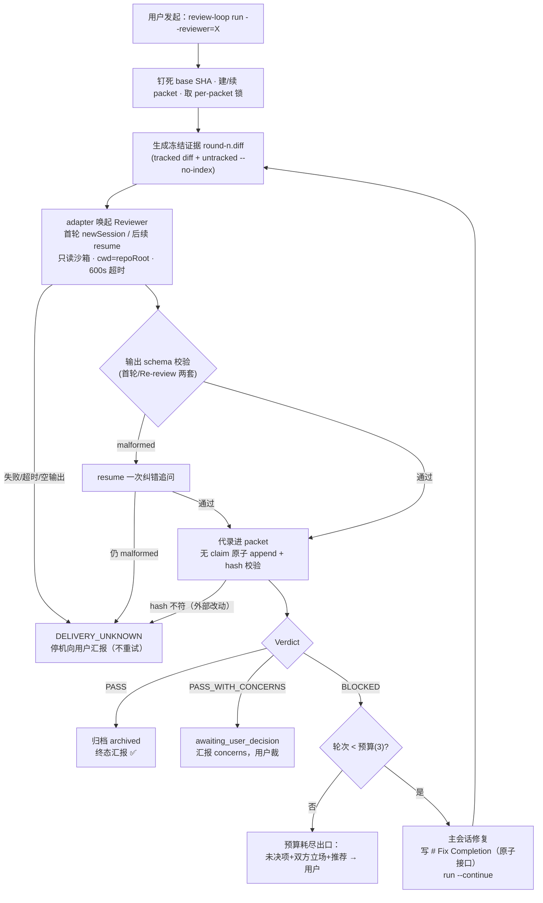

# Review Loop v2 · auto loop — 任务分解与验收标准

> 状态：**已定稿，待实现**（2026-07-22 grilling 会话逐题定案，用户逐条确认）。
> 分工：**Claude 规划（本文档）→ Grok 实现 → Codex 审查**。
> 本文档是唯一实现依据。§1–§20 的 v1 架构（`plan-2026-07-21-review-loop-orchestrator.md`）仅作历史参考，其双会话假设已被 dogfood 证伪（见其 §21）。

---

## 1. 背景（一段话版）

v1 走"双可见窗口 + packet 协商 + worktree freeze"路线，dogfood 一夜死了三次：agent 往 packet 中间插 H1（Incident A）、双窗都找人 continue（Incident B）、并发开发误触 freeze（Incident D），人变成全职 Protocol Gate 操作员。三个 Codex 会话（`019f84c2` / `019f84f7` / `019f84fb`）是原始判决书：**review 内容质量一直是好的，死的全是协调层**。v2 换拓扑：单可见会话驱动一切，对方 AI 只以 headless 只读方式被唤起。该拓扑同时是 2026 业界已收敛的主流形态（headless `codex exec` 做二审、goal loop 迭代到成功条件），且已有本仓 `coordinator-lite.sh` 的实证蓝本。

**用户的唯一目标**：执行 skill 之后，它自己 loop（review → fix → re-review），最后给终态结果。中间零打扰。

## 2. 目标与非目标

**目标**

1. 在**一个可见会话**里完成两个 AI 的审查-修复闭环，人只出现在发起、收口、异常三点。
2. Codex / Grok / Claude 三席任意组合（谁的窗口发起谁就是 Fixer；Reviewer 是参数）。
3. 复用 `agentic-review-handoff` 的 packet 资产与 `append-eof` 写入路径；闭环可从 packet 恢复。
4. 附带一个轻量 Consult 模式：随时把一道框定的决策题甩给另一个 AI 拿参考立场。

**非目标（v2 明确不做）**

- 自动多 Reviewer 评审团与意见合并仲裁（backlog，见 §9）。
- headless 派发带写权限的实现活（Delegate mode，backlog，见 §9）。
- `profile=deep` 盲评物化（保持 stub，处置随 v1 清理一并决定）。
- 双可见窗口路径的任何修补。

## 3. 已定决策（12 条，均经用户确认）

| # | 决策 | 关键理由 |
|---|---|---|
| D1 | **拓扑 A**：可见主会话 = Fixer；Reviewer 为 headless 只读唤起 | 单写者消灭 Incident A/D 的根因；命中"一个窗口看到全部完成" |
| D2 | **三席**：Codex / Grok / Claude 任一可当主会话或 Reviewer | 用户主力工具是三家；产品适配器抹平差异 |
| D3 | **成对**：1 Fixer + 1 Reviewer；第二意见 = 用户手动对同一 packet 再发起一轮 | 避免意见合并仲裁复杂度；review 块带署名 + reviewer 参数化保住升级路径 |
| D4 | **账本 = review-handoff packet**；单写者 + `append-eof` 唯一写入 | 可回溯、可恢复；bind/claim/freeze/双窗 PROMPT 整块停用 |
| D5 | **代录**：Reviewer 严格只读，stdout 由主会话代录进 packet | 保住 packet 单写者不变量；stdout 通路三家已验证 |
| D6 | **resume 通道**跨轮续会话，失败降级每轮新开 | re-review 本质是"对照自己上轮意见验收"；coordinator-lite 已付清机制成本 |
| D7 | **确定性子命令**承载唤起（沙箱旗标/超时/session id/STOP/失败停机全归代码） | "编排/预算/停止永远归代码"铁律；沙箱旗标是安全承重件，禁止模型手打 |
| D8 | **Consult 默认 advisory**：拍板权在用户；可单次显式授权"一致即采纳" | 用户是最终权威；surface conflicts, don't average |
| D9 | **收敛 8 条**（见 §6.4）：3 轮预算、拦路必可证伪、阻塞分级、不加戏、死锁上交、既有 Verdict 词表、提前收敛、diff ≤500 行护栏 | 3 轮有业界实证背书（收益在前 3–4 步内饱和） |
| D10 | **人的介入 = 发起 + 收口 + 异常**，循环中间零打扰 | 用户原话："loop review fixed，给我最终结果就可以了" |
| D11 | **入口 `review-loop run`，模式名 auto loop**；v1 双窗机器先降级封存，验收后一次性删除（破坏性更新已授权） | 删除不可逆，等 Demo 过绿再删 |
| D12 | **验收 = Demo 1（中性对象）→ Demo 2（自举）+ Grok 探针 + 两条负路径** | 闭环存活与实验设置分开测（v1 Incident D 教训） |

## 4. 术语表

| 术语 | 定义 |
|---|---|
| **auto loop** | v2 运行模式：单可见会话内自动跑完 review → fix → re-review 直到收敛。区别于 v1 dual-session loop |
| **Fixer / 主会话** | 用户正在使用的可见 AI 会话。唯一的 worktree 写者、唯一的 packet 写者、闭环驱动者 |
| **Reviewer** | 被 headless 唤起的对方 AI 会话。只读沙箱，产出走 stdout |
| **Product Adapter（产品适配器）** | 抹平三家 CLI 差异的最小契约：`newSession(prompt) → {text, sessionId}`、`resume(sessionId, prompt) → {text}`，内置各家只读沙箱旗标 |
| **代录（transcription）** | 主会话把 Reviewer stdout 写进 packet（经 `append-eof`）的动作。Reviewer 永不直接写 packet |
| **DecisionConsult（Consult）** | 一发一收的决策咨询：把一道框定的题交给另一个 AI 拿立场，无轮次、无 Verdict 机器 |
| **DELIVERY_UNKNOWN** | 唤起调用失败/超时/空输出的灰区终态：停机向用户汇报，不自动重试（沿用 coordinator-lite 语义） |
| **轮（round）** | 一次 review（或 re-review）+ 对应 fix 为一轮。预算默认 3 |

## 5. 架构总览

```text
┌────────────────────────────────────────────────────────────┐
│  可见主会话（Fixer，任一产品）                                │
│  · 驱动闭环：发起 → 逐轮唤起 Reviewer → 修复 → 收口汇报        │
│  · 唯一写者：代码 + packet（append-eof）                      │
│        │ 调用（阻塞子进程）                                   │
│        ▼                                                    │
│  review-loop run / invoke / consult（确定性子命令）           │
│  · 封死：只读沙箱旗标、超时看护、session id 簿记、STOP、        │
│    DELIVERY_UNKNOWN 停机                                     │
│        │ 按 --reviewer 分派                                  │
│        ▼                                                    │
│  Product Adapter ──► codex exec / claude -p / grok -p        │
│                      （headless、只读、stdout 返回）           │
└────────────────────────────────────────────────────────────┘
持久层：.review-handoff/active/<branch>/<packet>.md（阶段链不变：
Review Findings → Fix Handoff → Fix Completion → Re-review，frontmatter 由 append-eof 同步）
```

**依赖方向单向**：主会话 → 子命令 → adapter → headless CLI → stdout → 代录进 packet。没有回边、没有共享可变指针、没有第二控制面。

**v1 机器处置**：`bind` / `next` / `wait` / claim fencing / worktree freeze / Runtime Gate / 双窗 PROMPT 生成，在 auto loop 路径下**一律不调用**。代码与测试暂留（D11），文档标 legacy。

### 5.1 各产品 headless 调用参数（实测锚点，实现时以探针复核为准）

| 产品 | 新开 | resume | 只读沙箱 | 会话落点 |
|---|---|---|---|---|
| Codex | `codex exec -o <file> "<prompt>"` | `codex exec resume <uuid> "<prompt>"`（uuid 从 stderr `session id` 行捕获） | `-s read-only` | `~/.codex/sessions/`（originator=`codex_exec`，与 Desktop 同库） |
| Claude | `claude -p "<prompt>" --output-format json` | `claude -p --resume <id> ...`（id 取自 JSON `session_id`） | **必须同时** `--allowedTools "Read,Grep,Glob"` **+** `--disallowedTools "Write,Edit,MultiEdit,NotebookEdit,Bash"`（仅 allowedTools 探针失败：模型仍可写） | `~/.claude/projects/<项目>/`，`claude --resume` 可见 |
| Grok | `grok -p "<prompt>" --output-format json` | `grok -r <sessionId> -p "..."`（sessionId 为 JSON 一等字段；T0 已 PASS） | `--sandbox read-only`（仓库内写拒绝；`/tmp` 白名单 caveat） | `~/.grok/sessions/<cwd 编码>/` |

**Adapter 硬规则**：子进程一律以 `cwd=repoRoot` 启动（防从别处调用时 Reviewer 读错树）；Grok resume 探针未通过时自动降级"每轮新开"（one-shot），不阻塞任何验收；只读隔离或 diff 取证探针失败的产品，其 adapter **不得宣告可用**（go/no-go 见 T0）。

### 5.2 运行时流程图（一条闭环）



人只出现在三处：发起（A）、收口（I/J/L）、异常（Z）。图中所有判断框都是确定性代码，模型只产出 D（review 内容）和 M（修复）。

## 6. 任务分解（实现方：Grok）

> 每条任务附验收标准。实现顺序 = 编号顺序。所有新代码放
> `skills/agentic-review-handoff/scripts/review-loop/`（沿用现有目录），测试放 `scripts/test/`。
> 遵守仓库规约：改 skill 后跑 `pnpm skills:validate` + `pnpm skills:index`。

### T0 · 探针（P0，半天内）

做三件一次性验证，结论写进本文档末尾的"探针记录"节：

1. **Grok resume**：`grok -p` 新开（`--output-format json`，记录 session id 获取方式）→ `grok -r <id> -p` 追问，验证上下文延续。
2. **三产品只读 smoke**：三家各以 §5.1 参数唤起一次，确认 stdout 拿到回答、且写文件被沙箱拒绝（Codex/Claude 有 coordinator-lite 历史证据，本轮补 Grok 并复核前两家旗标未变）。
3. **真实 diff 取证能力**：给 Reviewer 一份冻结 diff 文件（机制见 T2）+ 一个只能靠读 diff 才能答对的问题，验证三家都能准确指认 diff 内的具体改动——不能只验证"能回答且不能写"。
4. **Codex Desktop 可见性**：在 Codex app 会话列表确认 `codex_exec` 会话是否显示（仅记录事实，不影响设计）。

**验收与 go/no-go**：探针记录含命令原文 + 输出摘要 + 结论。规则：resume 失败 → 该产品降级 one-shot（go）；**只读隔离失败或 diff 取证失败 → 该产品 adapter 不得宣告可用（no-go）**。

### T1 · Product Adapter

`scripts/review-loop/adapters.mjs`：三家产品各实现 `newSession` / `resume` 两操作。

- 只读沙箱旗标**硬编码在 adapter 内**，调用方无法关闭（安全承重件）；子进程一律 `cwd=repoRoot`。
- 超时看护：单手默认 600s（可环境变量覆盖），超时杀进程。
- 急停约定：全局 `<repo>/.review-handoff/STOP`（只由用户手动创建/删除）+ 单包 `<repo>/.review-handoff/runtime/<packet_id>/STOP`（run 正常收口时自动清理本包 STOP）；轮询语义沿用 coordinator-lite `run_to`。
- 失败语义：非零退出 / 空输出 / 超时 → 返回 `DELIVERY_UNKNOWN`，**不重试**（灰区纪律：无法机械证明"未投递"就停机，蓝本 coordinator-lite）。
- **resume 降级白名单**（与上一条不矛盾的唯一豁免——仅限可机械证明"未发起模型调用"的情形）：(a) 本地无 session id 记录；(b) T0 已判该产品 resume 不支持；(c) CLI 以可识别的 "session not found" 类错误立即拒绝。命中白名单 → 降级 `newSession` 并记录；其余（含连接中断类非零退出）一律 `DELIVERY_UNKNOWN` 停机——resume 请求可能已被远端接收，重开新会话会产出第二份 review 并错误推进状态。
- session id 簿记：持久化到 `.review-handoff/runtime/<packet_id>/reviewer-session.json`。

**验收**：单元测试（node --test）覆盖：超时杀进程、STOP 中断、空输出→DELIVERY_UNKNOWN、resume 白名单三情形逐一降级成功、**灰区情形（连接中断类非零退出）断言停机不降级**。用 fake 可执行文件模拟 CLI，不依赖真实登录。

### T2 · `review-loop run`（核心闭环引擎）

`node review-loop.mjs run --repo <root> --reviewer codex|grok|claude [--base <sha>] [--rounds 3] [--packet <id>]`

职责（每一步都是确定性代码，模型只产出 review/fix 内容本身）：

1. **发起**：解析被审范围（默认 `--base` 到 worktree 的 diff；未给 `--base` 时取 `HEAD`），钉死 base SHA 写入 packet frontmatter；创建或续用 packet；**取 per-packet 锁**（mkdir 锁 + 可回收死锁，蓝本 coordinator-lite，防两个并发 run 互相覆盖状态）。
2. **范围护栏**：diff > 500 行时不拒绝，但在输出中警告并建议拆分（决策权在用户）。
3. **冻结证据**：每轮生成冻结 diff 文件 `runtime/<packet_id>/evidence/round-<n>.diff`，由两部分拼接：`git diff <base> -- <paths>`（tracked 改动）**加上**范围内每个 untracked 文件的 `git diff --no-index /dev/null <file>`（新增未跟踪文件——纯 `git diff <base>` 对它们输出为空，会让 Reviewer 漏审整个新文件；禁止用 `git add -N` 等改动共享 index 的手法）。Reviewer prompt 指向该文件——三家产品无论有无 git 执行能力（Claude 只有 Read/Grep/Glob）都拿到同一份证据，也免疫审查期间树的后续变动。
4. **逐轮**：
   - 组装 Reviewer prompt（含：packet 路径、base SHA、冻结 diff 文件路径、被审 paths、收敛规则中 reviewer 义务、**结构化输出 schema**）；
   - 经 adapter 唤起（首轮 newSession，后续 resume）；
   - **解析并校验输出（fail-closed，分轮次两套 schema）**：
     - **首轮（Review Findings）**：findings 逐条含 `ID / 严重度([阻塞]|[非阻塞]) / 标题 / 证据 / Target files / Required fix / Acceptance check`（现有 packet `Fix Handoff` 表格的最小充分集，见 packet-anatomy.md），末行 Verdict；
     - **round ≥2（Re-review）**：对上一轮每个 finding ID 逐项给 `状态(resolved|partially|unresolved) + 复核证据`；`New Findings`（同首轮 schema，且按收敛规则只允许 load-bearing 阻塞项）；`Regression Surface`（邻近回归面结论）；**末行同样必须恰为一行 Verdict**——这是现有 packet `# Re-review` 必需 H2 结构的最小充分集，缺任何一节（含缺 Verdict）都按 malformed 处理；
     - malformed / 缺字段 → 经 resume **一次**纠错追问（内容级重问：投递已成功、输出在手，不属灰区重试）；仍 malformed → 停机汇报，packet 不写入任何半截阶段；
   - 把合法输出**代录**为 packet 阶段（首轮 `# Review Findings`（BLOCKED 时含 `# Fix Handoff`），后续 `# Re-review`）。
5. **packet 写入（无 claim 原子接口）**：v1 `append-eof` 强制 active claim（coordinator.mjs `cmdAppendEof`），auto loop 停用 claim 后**不可直接复用**——新增无 claim 的原子 stage writer（形态自定：`append-eof --mode=auto` 或 run 内部模块），不变量：只 EOF 追加、frontmatter 同步更新、**写后把 packet 内容 hash 记入 run-state，下次写前校验**；hash 不符（外部/人工中插改动）→ 拒绝追加、停机向用户汇报（终态汇报，不是需要 resolve 的 Gate）。
6. **Verdict 语义与生命周期（唯一定义；现有 lifecycle validator 与此冲突处，为 auto 路径调整 validator）**：
   - `PASS` → 收口 + 归档（archived）；
   - `PASS_WITH_CONCERNS`（Reviewer 只允许在剩余项全为 `[非阻塞]` 时使用）→ 收口 + `awaiting_user_decision`，终态汇报列出 concerns，用户决定归档或追加一轮——既对齐现有 lifecycle 语义，又满足"非阻塞不挡收口"；
   - `BLOCKED` → 阻塞项结构化返回主会话，主会话修复后写 `# Fix Completion`（同一原子接口）再 `run --continue` 进入下一轮。
7. **收敛引擎**（§6.4 规则的机器可执行部分）：轮数计数与上限、提前收敛（无阻塞项即收）、预算耗尽出口（结构化汇报：未决阻塞项 + 双方立场 + 推荐）。
8. **收口**：终态汇总（复用/改造现有 `summary`）：Verdict、findings 计数与处置、阶段链、轮数；释放锁。

> 实现形态说明：`run` 不是长驻进程。它是"每次调用推进一步、状态全在 packet + runtime 文件里"的可重入命令（`run` 发起、`run --continue` 续轮），主会话在两次调用之间完成修复。**恢复必须以全新 OS 进程成立**（崩溃/压缩后凭 packet + runtime 即可继续），也天然支持"追加第二意见"（换 `--reviewer` 对同一 packet 再来一轮，review 块署名区分）。

**验收**：
- 单元/集成测试（fake adapter）：完整 1 轮 PASS 链、BLOCKED→fix→re-review→PASS 两轮链、3 轮预算耗尽出口、提前收敛、`--reviewer` 换人续包（署名正确）。
- **并发与恢复**：两个并发 `run --packet` 只有一个推进（锁生效，用真实并发子进程测）；进程 A 完成 BLOCKED 轮后退出 → **全新 OS 进程** B `run --continue` 恢复成功。
- **packet 事务**：阶段链与 frontmatter 始终由原子接口维护（断言无 mid-file 写入）；调用间外部改写 packet → 拒绝追加 + 停机汇报。
- **输出 fail-closed**：首轮与 Re-review 两套 schema 各有 malformed 用例——一次纠错追问 → 仍错则停机且 packet 无半写。
- **冻结证据完整性**：范围内新增一个 untracked 文件 → 断言其全文出现在 round 证据文件中。
- 三种 Verdict 的生命周期终态各有测试（archived / awaiting_user_decision / 续轮）。
- 全程不产生任何需要人工 `resolve` 的状态（Protocol Gate 不在 auto loop 路径出现）。

### T3 · `review-loop consult`（决策咨询）

`node review-loop.mjs consult --repo <root> --peer codex|grok|claude --question-file <md>`

- 出题模板沿用 direct-discussion 的 framing 合同：用户原话（逐字）/需要决定的问题/已知事实/未验证假设/发起方观点（单独标记）/范围与禁止事项。
- 一发一收，advisory：结果返回主会话呈给用户；主会话不得据此静默拍板（除非用户当次显式授权"一致即采纳"）。
- 记录：consult 问答落 `.review-handoff/runtime/consults/<ts>-<slug>.md`（不进 packet 阶段链；若在闭环中途发起，packet 里追加一行指针）。

**验收**：fake adapter 测试一发一收 + 记录落盘；SKILL.md 写明 advisory 边界。

### T4 · 文档更新

1. `SKILL.md`：新增 auto loop 模式（触发语、`run`/`consult` 用法、人的三个介入点、收敛规则）；双窗路径整节标 **legacy（已被 dogfood 证伪，仅存档，勿新用）**。
2. `references/review-loop-playbook.md` 重写为 auto loop 为主；`worker-contract.md` / `human-control-plane.md` 标 legacy 或收缩。
3. 新增 `references/auto-loop-contract.md`：Reviewer prompt 模板、Verdict 输出约定、收敛 8 条全文。
4. 跑 `pnpm skills:validate` + `pnpm skills:index`。

**验收**：validate/index 通过；SKILL.md 的 description 与触发语覆盖"同一会话双 AI 审查闭环"类请求。

### T5 · 负路径测试（自动化）

1. Reviewer 唤起失败 → `DELIVERY_UNKNOWN` → run 停机并输出用户可读汇报（不静默重试、不留半写阶段）。
2. 3 轮预算耗尽仍有阻塞项 → 规范终态汇报（未决项 + 双方理由 + 推荐），packet 保持可续（新一轮授权 = 再跑 `run --continue --rounds +N`）。
3. packet 在两次调用之间被外部改写 → hash 校验拒绝追加 + 停机汇报。
4. Reviewer 输出 malformed → 一次纠错追问 → 仍 malformed → 停机且 packet 无半写。

**验收**：四条均为 node --test 自动化用例，无人工步骤。

### T6 · Demo 1（硬验收 · 中性对象）

在一个可见会话对一批真实小改动（≤500 行、**禁止是 `agentic-review-handoff` 自身**）发起 auto loop：

- 零人工介入直到同一窗口输出终态汇报；
- headless Reviewer 产出 ≥1 条真实 finding；fix 与 re-review 真实发生；
- packet 阶段链健康、归档成功；
- 全程无任何人工 resolve 请求。

**验收人**：用户。留存：packet 归档件 + 终态汇报原文。

### T7 · Demo 2（自举）

Demo 1 通过后：以 **Grok 产出的 v2 实现 diff 本身**为被审对象，`run --reviewer=codex` 零介入跑到终态。发起时钉死 base SHA。

**验收人**：用户。此 demo 同时是本需求的最终交付检验。

### T8 · v1 清理（Demo 2 通过后，单独 commit）

一次性删除双窗协调机器：`bind`/`next`/`wait`/claim/freeze/Runtime Gate/双窗 PROMPT 生成/`open` 及对应测试与 legacy 文档段落；`profile=deep` stub **一并删除**（已定案，不留二选一）。破坏性更新已获用户授权，但仍须：删除前 `git status` 确认无他人 WIP、删除为独立 commit、commit body 引用本文档。

**验收**：删除后 `pnpm skills:validate`、`pnpm skills:index`、全部 node --test 通过；SKILL.md 无悬空引用。

### 6.4 收敛规则（全文，写进 auto-loop-contract.md）

1. 轮次预算默认 3；预算是**上限不是配额**。
2. **提前收敛**：某轮 re-review 确认全部阻塞项已解决且无新阻塞项 → 立即 PASS 收口。
3. Reviewer 拦路必须可证伪：点名具体 breakage（正确性/契约/安全/数据丢失）；"不够优雅/风格/口味"永远不是阻塞理由。
4. 每条 finding 标 `[阻塞]` / `[非阻塞]`；只有阻塞项挡 PASS，非阻塞一律记 backlog。
5. 第二轮起不许加戏：新意见只允许真 load-bearing 的阻塞项。
6. 死锁（Fixer 不认、Reviewer 坚持）→ 停止对轰，run 以结构化分歧汇报收口，用户拍板。
7. Verdict 词表沿用 skill 现有：`PASS` / `PASS_WITH_CONCERNS` / `BLOCKED`；三者的收口与生命周期语义以 T2 第 6 条为唯一定义。
8. 被审 diff 建议 ≤500 行，超限警告并建议拆条。
9. 预算耗尽/死锁的出口永远是"向用户汇报"，**不是冻结全场的 Gate**；用户 continue = 新一轮预算（多张票语义）。

## 7. 协作契约（本需求的实现过程）

| 角色 | 谁 | 职责 |
|---|---|---|
| 规划 | Claude（已完成） | 本文档；实现中的疑问优先回到本文档与引用材料，语义不明处上交用户 |
| 实现 | Grok | T0–T5 按序实现；每个 T 完成后 commit（只 add 自己的文件，遵守仓库提交纪律） |
| 审查 | Codex | 对 Grok 的实现 diff 做独立 review。**实现期间 v2 尚不存在，走 skill 现有 legacy packet 流程（用户人肉交棒）**；Demo 1 通过后，后续轮换用 v2 自己跑（即 Demo 2） |
| 拍板 | 用户 | 发起/收口/异常三点；死锁裁决；Demo 1/2 验收 |

实现期间同样适用 §6.4 收敛规则（3 轮、可证伪拦路、死锁上交用户）。

### 7.1 实施路线流程图


工具说明：实现方**不需要**调用 skill-creator / repo-skill-creator——本次是改现有 skill 的脚本层，所需校验已在 T4 写死为确定性命令（`pnpm skills:validate` + `pnpm skills:index`）。

## 8. 验收标准汇总（checklist）

- [ ] T0 探针记录三条齐全（Grok resume 结论明确：PASS 或降级 one-shot）
- [ ] T1–T3 全部 node --test 通过（含 T5 两条负路径）
- [ ] `pnpm skills:validate` + `pnpm skills:index` 通过
- [ ] Demo 1：中性对象、零介入、终态汇报、packet 归档、无人工 resolve
- [ ] Demo 2：自举本实现 diff，零介入到终态
- [ ] T8 清理后全量测试与校验仍绿（单独 commit）

## 9. Backlog（明确不做，留档防加戏）

| 项 | 内容 | 升级条件 |
|---|---|---|
| N-Reviewer 评审团 | 同轮并行多 reviewer + 意见合并仲裁 | 成对模式 dogfood 稳定后，且真实出现"单 reviewer 漏检"证据 |
| Delegate mode | headless 派发带写权限的实现活给另一模型 | 需先设计"独占移交"语义保住单写者不变量；且注意 Grok durable goal（/goal）激活是 user-only，headless 不可达 |
| deep profile 盲评 | 独立盲答 + 交叉质疑物化进 packet | 标准路径转绿后按需求再议（当前倾向 T8 一并删除 stub） |
| Grok 三席 Consult 面板 | consult 同时问两家取立场对照 | consult 单发模式用出真实需求后 |

## 10. 参考与证据

**仓内**
- v1 架构与 dogfood 复盘：`docs/review-loop-orchestrator/plan-2026-07-21-review-loop-orchestrator.md`（§21 失败实录、§22 产品面板）
- 唤起机制蓝本：`docs/review-loop-orchestrator/coordinator-lite.sh`（`run_to` 超时看护 / session 捕获 / STOP / DELIVERY_UNKNOWN）
- Consult 出题模板：`docs/review-loop-orchestrator/direct-discussion.md`（kickoff framing 合同）
- 收敛规则母本：`docs/review-loop-orchestrator/PROTOCOL.md`（收敛与终止节）
- 失败实证（Codex 会话）：`~/.codex/sessions/2026/07/21/rollout-*-019f84c2-*.jsonl`、`*-019f84f7-*`、`*-019f84fb-*`

**外部（2026-07-22 检索）**
- 3 轮预算实证：[Is Three the Magic Number?（LLM 修复循环轮数实证）](https://arxiv.org/pdf/2607.05197)、[Self-Review 框架（约 3 轮后饱和）](https://arxiv.org/pdf/2507.05598)
- 拓扑先例：[Running headless Codex CLI inside Claude Code](https://amanhimself.dev/blog/running-headless-codex-cli-inside-claude-code/)、[Claude Code × Codex review loop 自动化](https://smartscope.blog/en/blog/claude-code-codex-review-loop-automation-2026/)、[codex exec headless 模式](https://deepwiki.com/openai/codex/4.2-headless-execution-mode-(codex-exec))
- 停止条件设计：[Loop engineering](https://www.mindstudio.ai/blog/what-is-loop-engineering-ai-coding-agents)、[多模型收敛循环](https://zylos.ai/research/2026-03-01-multi-model-ai-code-review-convergence/)
- diff 规模护栏：[AI code review 工具综述（>500 行质量骤降）](https://dev.to/heraldofsolace/the-best-ai-code-review-tools-of-2026-2mb3)

## 评审记录

| 轮 | 评审者 | 结论 | 处置 |
|---|---|---|---|
| R1 · 2026-07-22 | Codex（headless read-only，session `019f87b8-b4b7-7b20-a5ce-38053f25775e`） | BLOCKED：6 条阻塞（append-eof 的 claim 依赖 / PASS_WITH_CONCERNS 生命周期冲突 / Reviewer 输出 schema 不足 / resume 降级与灰区纪律矛盾 / Reviewer 取证能力（cwd + 冻结 diff）/ 并发锁与全新进程恢复验收缺失）+ 4 条非阻塞 | 6 条阻塞全部修订进 §5.1 / T0 / T1 / T2 / T5；非阻塞采纳 3 条（STOP 约定、deep stub 定案删除、T0 go/no-go） |
| R2 · 2026-07-22 | Codex（resume 同一会话） | BLOCKED：4/6 resolved；剩 2 条——Re-review 缺专用 schema（无法生成含必需 H2 的合法阶段）、冻结 diff 漏 untracked 新文件（Reviewer 会漏审整个新文件）；无新增阻塞项 | 两条修订进 T2（分轮次双 schema、证据拼接 untracked `--no-index` diff）+ T2 验收补两条用例 |
| R3 · 2026-07-22 | Codex（resume 同一会话） | BLOCKED：项 5 resolved；项 3 剩一毫米——round ≥2 schema 未明写末行 Verdict；无新增阻塞项 | 一句话修订（Re-review schema 明写末行 Verdict，缺 Verdict 按 malformed）；3 轮预算用尽，用户侧追加收口轮 |
| R4 · 2026-07-22 | Codex（resume 同一会话） | **PASS**：项 3 resolved，无新增阻塞项 | 定稿。本表 4 轮本身即 D1/D5/D6 拓扑的首次实战（headless 只读 + resume + 代录） |

## 探针记录（2026-07-22 T0 完成）

| 探针 | 结论 | 证据 |
|---|---|---|
| Grok headless 新开 | **PASS** | `grok -p "Reply with exactly: PONG-T0-B" --output-format json --sandbox read-only` → JSON 一等字段 `sessionId=019f87d0-ebde-7653-bcb5-d0c14f58088c`，`text=PONG-T0-B` |
| Grok resume | **PASS**（无需降级 one-shot） | `grok -r 019f87d0-… -p "What exact token…" --output-format plain --sandbox read-only` → `PONG-T0-B`（上下文延续） |
| Grok 只读隔离 | **PASS（带 caveat）** | 仓库内写探针 `docs/review-loop-orchestrator/.t0-write-probe-should-fail.txt` → `WRITE-RESULT:DENIED` / `Operation not permitted`，文件不存在；**caveat：`/tmp` 在 Grok 沙箱白名单内可写**（packet/subject 均在仓库内，无害） |
| Grok diff 取证能力 | **PASS** | 冻结 diff（`UNIQUE_MARKER_PROBE_X9F2` + `computeWidgetScore` off-by-one）→ 正确回报 `MARKER: UNIQUE_MARKER_PROBE_X9F2` / `OFF_BY_ONE: yes` / `VERDICT: PASS` |
| Codex 只读 smoke + diff 取证 | **PASS** | `codex exec -s read-only --skip-git-repo-check -o <out> "<prompt>"` → session `019f87d1-49f5-7461-a74b-b2db6928337f`；MARKER/OFF_BY_ONE 正确；写文件被拒（`writing is blocked by read-only sandbox`）；originator=`codex_exec` |
| Codex resume | **PASS** | 新开 `CODEX-T0-R1`（session `019f87d4-3736-7ca3-8e54-5896d73e174d`）→ `codex exec … resume <uuid> "What exact token…"` → `CODEX-T0-R1` |
| Claude 只读 smoke + diff 取证 | **PASS** | `claude -p … --allowedTools "Read,Grep,Glob" --output-format json` 能正确读冻结 diff（MARKER/OFF_BY_ONE）；`session_id` 一等字段 |
| Claude 只读隔离 | **PASS（须 hardened 旗标）** | **仅** `--allowedTools "Read,Grep,Glob"` **失败**：探针文件被真实写入（`WRITE:OK`）。**必须**追加 `--disallowedTools "Write,Edit,MultiEdit,NotebookEdit,Bash"` → `WRITE:DENIED`，文件不存在。adapter 硬编码两套列表 |
| Claude resume | **PASS** | 新开 `CLAUDE-T0-R1`（session `6b667344-821d-4c6c-85cd-708513fd8019`）→ `claude -p --resume <id> …` 回报 `CLAUDE-T0-R1` |
| Codex Desktop 可见性 | **FS 同库已证；Desktop UI 待用户点一眼** | 探针 session 落盘 `~/.codex/sessions/2026/07/22/rollout-…-019f87d1-….jsonl`，payload `originator=codex_exec`；库内 ≥333 个 `codex_exec` 样本。是否出现在 Desktop 会话列表**不影响设计** |

### go/no-go（T0）

| 产品 | resume | 只读隔离 | diff 取证 | adapter 可宣告可用 |
|---|---|---|---|---|
| Grok | PASS | PASS（repo；`/tmp` caveat） | PASS | **YES** |
| Codex | PASS | PASS | PASS | **YES** |
| Claude | PASS | PASS（allowed+disallowed） | PASS | **YES**（adapter 必须硬编码 disallowedTools） |
